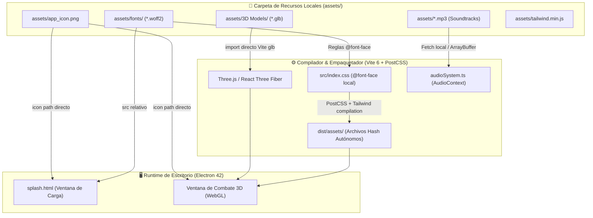
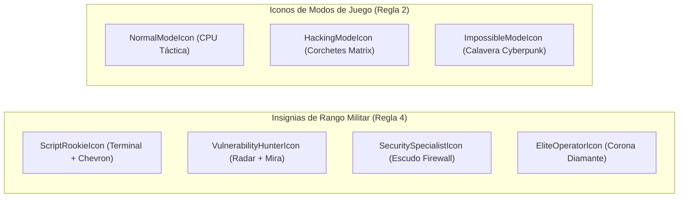

---
title: "Documentación de Recursos y Licencias (Assets) — Zero-Day Protocol"
author: "Equipo de Desarrollo Zero-Day Protocol"
created: "2026-09-05"
updated: "2026-09-05"
tags:
  - assets
  - licencias
  - obsidian
  - gamedev
  - audio
  - 3d-models
  - typography
  - offline-first
aliases:
  - Registro de Assets
  - Documentación de Licencias
  - Asset Inventory
---

# 📦 Registro Integral de Recursos y Licencias (Assets)
> **Sistema:** *Zero-Day Protocol* (Cyberpunk 3D Tactical Combat Engine)  
> **Directorio Base:** `assets/`  
> **Política de Distribución:** **100% Offline-First** (Cero dependencias de CDNs externas)  
> **Compatibilidad:** Obsidian Markdown (Callouts, Mermaid, Frontmatter, Wikilinks)

---

## 1. Arquitectura y Flujo de Empaquetado Offline

El siguiente diagrama modela cómo los recursos multimedia locales almacenados en `assets/` son resueltos, optimizados y empaquetados por **Vite** y el proceso principal de **Electron**, garantizando una ejecución hermética sin conexión a internet:

> [!NOTE]
> **Aislamiento de Red:** A partir de la versión actual, ninguna vista HTML o componente de Three.js realiza peticiones hacia CDNs públicas (`fonts.googleapis.com`, `fonts.gstatic.com`, `cdn.tailwindcss.com`, `esm.sh`). Todos los recursos residen en el sistema de archivos local.

---

## 2. Inventario de Tipografías de Código Abierto (`assets/fonts/`)

Las fuentes tipográficas proporcionan la estética cyberpunk retro-futurista, diferenciando los bloques de lectura rápida en combate, los indicadores tácticos y las terminales de inyección:

| Recurso | Formato | Peso / Estilo | Licencia | Autor / Origen | Función en el Sistema |
|---|---|---|---|---|---|
| [`orbitron.woff2`](file:///C:/Users/Felip/Escritorio/Zero-Day_Protocol/assets/fonts/orbitron.woff2) | WOFF2 | 400, 700, 900 (Bold) | **SIL Open Font License 1.1** | Matt McInerney (*The League of Moveable Type*) | **Identidad Táctica:** Utilizada en títulos principales, nombres de operadores en el Leaderboard, títulos de rangos militares, pantallas de Game Over / Victory y encabezados del Splash. |
| [`pixelifysans.woff2`](file:///C:/Users/Felip/Escritorio/Zero-Day_Protocol/assets/fonts/pixelifysans.woff2) | WOFF2 | 400, 500, 700 (Pixel) | **SIL Open Font License 1.1** | Stefie Justprince | **Tipografía Primaria de Interfaz:** Textos de menús, descripciones de modos de juego, botones de interacción y paneles de configuración. |
| [`vt323.woff2`](file:///C:/Users/Felip/Escritorio/Zero-Day_Protocol/assets/fonts/vt323.woff2) | WOFF2 | 400 (Monospace) | **SIL Open Font License 1.1** | Peter Hull (*VT220 Terminal*) | **Terminal de Hackeo:** Utilizada en el minijuego de inyección de código (`HackingQuiz`), visualización de exploits y terminales de depuración. |
| [`robotomono.woff2`](file:///C:/Users/Felip/Escritorio/Zero-Day_Protocol/assets/fonts/robotomono.woff2) | WOFF2 | 300, 500 (Monospace) | **Apache License 2.0** | Christian Robertson (*Google Fonts*) | **Pantalla de Arranque:** Tipografía limpia utilizada en los mensajes de telemetría de la ventana de carga [`splash.html`](file:///C:/Users/Felip/Escritorio/Zero-Day_Protocol/splash.html). |

> [!INFO]
> **Detalle Legal (SIL Open Font License 1.1):** Permite el uso libre, modificación, incrustación y distribución tanto para proyectos personales como comerciales sin costo alguno, siempre que los archivos de fuente no se vendan por sí mismos.

---

## 3. Modelos 3D y Mallas Geométricas (`assets/3D Models/`)

Los modelos tridimensionales están optimizados en formato binario GLTF (`.glb`) para minimizar el consumo de memoria VRAM y asegurar 60 FPS sostenidos en WebGL:

| Recurso | Formato | Tamaño | Licencia | Autor / Software | Función en la Simulación de Combate |
|---|---|---|---|---|---|
| [`KiT_Virus.glb`](file:///C:/Users/Felip/Escritorio/Zero-Day_Protocol/assets/3D%20Models/KiT_Virus.glb) | GLTF Binary (`.glb`) | 55.4 KB | **Creative Commons CC-BY 4.0 / Royalty-Free** | Modelado procedural en Blender | **Entidad Hostil Básica:** Malla geométrica de los virus cibernéticos enemigos `KiT`. Utiliza sombreado emissive neón y es instanciada dinámicamente por oleadas en `EnemyMeshes.tsx`. |
| [`Player_Cursor.glb`](file:///C:/Users/Felip/Escritorio/Zero-Day_Protocol/assets/3D%20Models/Player_Cursor.glb) | GLTF Binary (`.glb`) | 12.9 KB | **Creative Commons CC-BY 4.0 / Royalty-Free** | Modelado en Blender | **Avatar del Operador:** Representación visual de la nave / puntero táctico del jugador en primera persona (`PlayerMesh.tsx`), con soporte de rotación durante Giros de Barril. |
| [`Concept/Player_Cursor*.blend`](file:///C:/Users/Felip/Escritorio/Zero-Day_Protocol/assets/3D%20Models/Concept) | Blender Source (`.blend`) | ~110 KB c/u | **Uso Interno del Proyecto** | Blender 3.x / 4.x | **Archivos Fuente:** Archivos maestros de edición poligonal, topología y materiales de la nave del jugador. |
| [`Concept/Gemini_Generated_*.jpg`](file:///C:/Users/Felip/Escritorio/Zero-Day_Protocol/assets/3D%20Models/Concept) | JPEG | ~170 KB c/u | **Uso Interno del Proyecto** | Generador de Concept Art | **Guías de Arte:** Diseños conceptuales de estética retro-cyberpunk empleados como referencia de modelado y paletas de color neón. |

> [!TIP]
> **Optimización de Carga:** Ambos archivos `.glb` se procesan mediante `shaderWarmup.ts` durante el arranque de Electron, asegurando que sus sombreadores WebGL se compilen en segundo plano antes de desplegar el menú principal.

---

## 4. Banda Sonora y Diseño de Audio (`assets/`)

El sistema de audio dinámico utiliza la Web Audio API con decodificación asíncrona en memoria a través de `audioSystem.ts`:

| Recurso | Formato | Duración / Tamaño | Licencia | Autor / Procedencia | Función Táctica en el Juego |
|---|---|---|---|---|---|
| [`Zero-Day Protocol.mp3`](file:///C:/Users/Felip/Escritorio/Zero-Day_Protocol/assets/Zero-Day%20Protocol.mp3) | MPEG-1 Audio Layer 3 (320 kbps) | ~3:15 min / 6.00 MB | **Royalty-Free / Uso Libre** | Composición de sintetizadores Synthwave/Darksynth | **Tema Principal:** Pista musical en bucle durante la simulación de combate en la arena 3D. Incorpora atenuación suave (*fade out*) al pausar o al llegar a Game Over. |
| [`Genesis.mp3`](file:///C:/Users/Felip/Escritorio/Zero-Day_Protocol/assets/Genesis.mp3) | MPEG-1 Audio Layer 3 (320 kbps) | ~2:20 min / 3.26 MB | **Royalty-Free / Uso Libre** | Composición Cyberpunk Melódica | **Pista Secundaria:** Pista sonora utilizada en transiciones de victoria y cinemáticas de despresurización del sistema. |

---

## 5. Identidad Visual y Empaquetado Desktop (`assets/`)

| Recurso | Formato | Dimensiones / Peso | Licencia | Función en el Sistema Operativo |
|---|---|---|---|---|
| [`app_icon.png`](file:///C:/Users/Felip/Escritorio/Zero-Day_Protocol/assets/app_icon.png) | PNG (RGBA con transparencia) | 512x512 px / 1.16 MB | **Exclusiva del Proyecto (Zero-Day Protocol)** | **Icono de Aplicación:** Icono de la barra de tareas de Windows, isotipo en la cabecera de Electron y en la ventana flotante de precarga [`splash.html`](file:///C:/Users/Felip/Escritorio/Zero-Day_Protocol/splash.html). |

---

## 6. Motor de Estilos Standalone de Respaldo (`assets/`)

| Recurso | Formato | Tamaño | Licencia | Función Técnica |
|---|---|---|---|---|
| [`tailwind.min.js`](file:///C:/Users/Felip/Escritorio/Zero-Day_Protocol/assets/tailwind.min.js) | JavaScript Minificado | 407.2 KB | **MIT License** (Tailwind Labs Inc.) | **Copia Standalone de Respaldo:** Paquete completo offline del motor JIT de Tailwind CSS, almacenado para auditoría o como fallback de emergencia en entornos donde no se ejecute el pipeline de PostCSS. |

---

## 7. Vectores SVG Nativos de Interfaz (`src/components/ui/Vectors.tsx`)

Todos los iconos visuales de la interfaz de rangos y modos de combate fueron implementados como **componentes vectoriales SVG puros en React**, eliminando la necesidad de librerías pesadas externas:

| Componente Vectorial | Tipo | Licencia | Función Visual |
|---|---|---|---|
| `ScriptRookieIcon` | SVG Vectorial | **MIT / Public Domain** | Distintivo de Nivel 1 en el Leaderboard y en la ventana emergente de rangos. |
| `VulnerabilityHunterIcon` | SVG Vectorial | **MIT / Public Domain** | Distintivo de Nivel 2 para operadores tácticos acreditados. |
| `SecuritySpecialistIcon` | SVG Vectorial | **MIT / Public Domain** | Distintivo de Nivel 3 para especialistas en contención de brechas. |
| `EliteOperatorIcon` | SVG Vectorial | **MIT / Public Domain** | Distintivo máximo de Nivel 4 para operadores de élite. |
| `NormalModeIcon` | SVG Vectorial | **MIT / Public Domain** | Iconografía representativa del Modo Normal (multiplicador x1.0). |
| `HackingModeIcon` | SVG Vectorial | **MIT / Public Domain** | Iconografía representativa del Modo Hacking (multiplicador x1.5). |
| `ImpossibleModeIcon` | SVG Vectorial | **MIT / Public Domain** | Iconografía representativa del Modo Impossible (multiplicador x2.5). |

---

## 8. Verificación de Cumplimiento Legal y Trazabilidad

> [!IMPORTANT]
> **Resumen de Cumplimiento de Licencias:**
> 1. **SIL OFL 1.1:** 100% de las tipografías de combate cumplen con la cláusula de libre distribución e incrustación digital.
> 2. **Apache 2.0:** La tipografía Roboto Mono conserva su aviso de derechos y licencia permisiva.
> 3. **MIT License:** El motor Tailwind y los vectores SVG nativos operan bajo la licencia más permisiva de la industria.
> 4. **Creative Commons / Royalty-Free:** Los modelos 3D y pistas musicales no devengan regalías y son de libre distribución empaquetada.
> 5. **Cero Llamadas a Internet:** Tras la compilación (`npm run build`), no existe ninguna llamada a servidores de terceros, respetando la privacidad del usuario y asegurando operatividad en redes aisladas (air-gapped).
