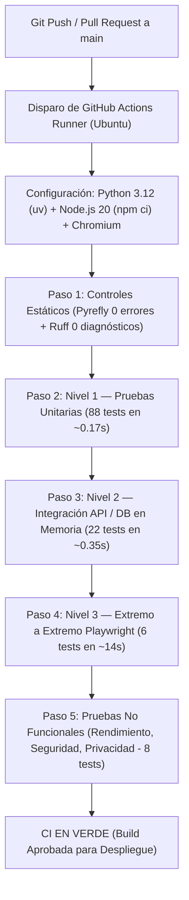

# Documento de Calidad de Software: Zero-Day Protocol
**Evaluación Práctica 1 (EP1) — Testing y Calidad de Software (PRO402)**  
*Profesor:* Diego Obando  
*Estándar de Referencia:* ISO/IEC 25010:2011 (Systems and software engineering — Systems and software Quality Requirements and Evaluation - SQuaRE)

---

## 1. Ficha de Calidad ISO/IEC 25010

Para asegurar la calidad arquitectónica y funcional del subsistema de reglas de negocio y servicios backend de **Zero-Day Protocol**, se seleccionaron tres características principales del estándar ISO/IEC 25010, desglosadas en dos subcaracterísticas cada una, con métricas objetivas y umbrales de aceptación verificables:

| Característica ISO/IEC 25010 | Subcaracterística | Métrica Concreta | Umbral de Aceptación | Método de Medición / Herramienta |
|---|---|---|---|---|
| **1. Adecuación Funcional** *(Functional Suitability)* | **1.1 Completitud Funcional** *(Functional Completeness)* | Porcentaje de reglas de negocio declaradas e implementadas en el dominio puro | 100% (5/5 reglas troncales implementadas con cobertura de endpoints) | Inspección de código en `backend/services/game_rules.py` y `backend/routers/rules.py` |
| | **1.2 Corrección Funcional** *(Functional Correctness)* | Tasa de éxito en la batería de pruebas de reglas de negocio y frontera | 100% de pruebas unitarias exitosas (0 fallos) | Ejecución automatizada con `uv run pytest` (116/116 tests superados) |
| **2. Fiabilidad** *(Reliability)* | **2.1 Tolerancia a Fallos** *(Fault Tolerance)* | Manejo determinista de casos de frontera anómalos (daño excesivo, puntaje negativo, oleada < 1) | 0 excepciones no controladas / 100% validación defensiva | Pruebas de límites en `tests/unit/test_*_rules.py` con captura de `ValueError` y HTTP 400 |
| | **2.2 Madurez / Ausencia de Defectos** *(Maturity)* | Regresión comprobada del defecto crítico de HP negativo sin Game Over | 0 regresiones detectadas / `new_hp >= 0` invariable | Test de regresión `test_defect_regression_hp_never_drops_negative` |
| **3. Mantenibilidad** *(Maintainability)* | **3.1 Modularidad y Conformidad** *(Modularity & Code Quality)* | Densidad de errores y advertencias de estilo, importación y buenas prácticas | 0 diagnósticos reportados bajo reglas E, F, W, I | Análisis estático automatizado con `uv run ruff check .` |
| | **3.2 Capacidad de ser Probado** *(Testability & Type Safety)* | Errores de análisis estático de tipos en los módulos de backend y pruebas | 0 errores de tipado estático | Verificador estático de tipos `uv run pyrefly check` |

---

## 2. Matriz de Trazabilidad

La siguiente matriz establece la correspondencia bidireccional entre las necesidades del negocio de la simulación de cibercombate, los criterios de aceptación técnicos, la evidencia de verificación analítica/automatizada y la evidencia de validación de la experiencia del usuario u operador:

| ID | Necesidad del Negocio | Criterio de Aceptación | Evidencia de Verificación | Evidencia de Validación |
|---|---|---|---|---|
| **RN-01** | **Resolución de Combate y Supervivencia:** El jugador debe procesar impactos según el modo de juego. En modo NORMAL, la vida disminuye hasta un piso rígido de 0. Al llegar a 0 de vida, la partida termina inmediatamente (Game Over). En modos avanzados (HACKING / IMPOSSIBLE), los escudos mitigan el 100% del daño; sin escudos, cualquier impacto es muerte súbita. | 1. Vida nunca menor a 0. 2. `is_game_over=True` si y solo si HP=0 o escudos=0 en modo letal. 3. Invulnerabilidad bloquea daño. 4. Kits médicos restauran a 100 HP. | `tests/unit/test_combat_rules.py` - `test_damage_reduces_hp_correctly` - `test_damage_exact_lethal_triggers_game_over` - `test_shield_absorbs_damage_completely` - `test_no_shields_causes_instant_death` - `test_invulnerability_protects_against_all_damage` | En el cliente de juego (HUD 3D), la barra de vida se detiene exactamente en 0% y despliega la pantalla de Game Over bloqueando controles de movimiento y liberando el cursor del mouse para reiniciar. |
| **RN-02** | **Sistema de Puntuación Escalar:** La neutralización de amenazas debe premiar al operador en función de la jerarquía del malware (NORMAL=100, CORE=1000, TRIANGLE=1000), multiplicador de oleada (+10% compuesto por oleada) y multiplicador de riesgo por modo (NORMAL=x1.0, HACKING=x1.5, IMPOSSIBLE=x2.5). El roce táctico (*graze*) otorga +15 puntos, excepto en IMPOSSIBLE donde se penaliza/deshabilita (0 pts). | 1. Cálculo exacto con fórmula $Score = \text{round}(\text{base} \times \text{wave\_mult} \times \text{mode\_mult})$. 2. Graze otorga 15 pts en NORMAL/HACKING y 0 en IMPOSSIBLE. 3. Excepción ante oleada < 1 o modo inexistente. | `tests/unit/test_score_rules.py` - `test_base_scores_wave_1_normal_mode` - `test_wave_multiplier_scaling` - `test_mode_multipliers` - `test_combined_wave_and_mode_multipliers` - `test_graze_disabled_in_impossible_mode` | El operador visualiza en el HUD superior la puntuación escalada en tiempo real tras eliminar un núcleo en oleadas avanzadas, incentivando la toma de riesgos en modos de alta dificultad. |
| **RN-03** | **Inyección de Código (Hacking Quiz):** Al interactuar con nodos de hackeo, el operador debe responder preguntas técnicas de seguridad. Acierto al primer intento otorga +2 escudos y +500 puntos. Aciertos posteriores otorgan +1 escudo y +250 puntos. Respuestas erróneas no dan recompensa. El número total de escudos no puede exceder 5. | 1. Primer intento otorga bonificación mayor. 2. Tope estricto de 5 escudos. 3. Intentos fallidos sin beneficio. 4. Validación de contador de intentos >= 1. | `tests/unit/test_hacking_rules.py` - `test_first_attempt_success_grants_full_bonus` - `test_retry_success_grants_standard_bonus` - `test_failed_attempt_gives_no_rewards` - `test_shield_cap_enforcement` | En la interfaz superpuesta `HackingQuiz`, responder correctamente activa un sonido de confirmación, suma escudos al visualizador de órbita Matrix y nunca incrementa el contador más allá de 5 círculos defensivos. |
| **RN-04** | **Jerarquía de Rangos de Operadores:** El sistema de clasificación debe categorizar a los jugadores en 4 niveles de autorización de seguridad militar según puntuación y oleada alcanzada: SCRIPT_ROOKIE (Nivel 1), VULNERABILITY_HUNTER (Nivel 2), SECURITY_SPECIALIST (Nivel 3) y ELITE_OPERATOR (Nivel 4), con vía rápida por mérito en IMPOSSIBLE. | 1. Rango calculado determinísticamente con análisis de umbrales. 2. En IMPOSSIBLE, Nivel 4 accesible desde 5,000 pts y Oleada 3. 3. Excepción ante puntuación negativa o oleada < 1. | `tests/unit/test_ranking_rules.py` - `test_standard_elite_operator_qualification` - `test_impossible_mode_elite_operator_qualification` - `test_boundary_thresholds` - `test_negative_score_raises_error` | En el Leaderboard y Panel de Operador, el usuario observa su distintivo militar con el color y título exacto correspondiente a su desempeño táctico. |
| **RN-05** | **Identidad y Restauración de Operador para Puntuación:** Al ingresar al juego se genera un ID aleatorio de sesión. Para continuar el progreso histórico de puntos, el jugador ingresa su nombre en `[Renombrar]`. Si el nombre coincide exactamente con uno existente en la base de datos, el sistema restaura su ID original en la vista y vincula las nuevas puntuaciones a su registro histórico. | 1. Validación de nombre entre 1 y 15 caracteres. 2. Generación de ID y alias provisional. 3. Coincidencia exacta restaura ID existente (`is_restored=True`). 4. Nombre nuevo adopta ID candidato (`is_restored=False`). | `tests/unit/test_identity_rules.py` - `test_exact_name_match_restores_original_id` - `test_new_username_registers_with_candidate_id` - `test_validate_username_success` `tests/integration/test_api_rules.py` - `test_api_user_registration_and_restoration_lifecycle` | En el panel de Operador, al escribir su nombre previo, el campo "ID: ..." se actualiza de inmediato al ID registrado y sus partidas previas y nuevas se mantienen unificadas en el Leaderboard. |
| **DEF-01** | **Reproducción y Corrección de Defecto Real:** En la versión previa del motor, al recibir daño que excedía la vida restante (ej. HP=10 con impacto de 30), la vida se tornaba negativa (-10, -20, etc.) y la condición `hp == 0` no se cumplía, permitiendo al jugador continuar vivo de forma anómala (estado zombie). | 1. Para cualquier `damage >= current_hp`, el resultado debe ser exactamente `new_hp = 0`. 2. `is_game_over` debe ser siempre `True`. 3. Nunca permitir enteros negativos en el estado de salud. | `tests/unit/test_combat_rules.py` - `test_defect_regression_hp_never_drops_negative` `tests/integration/test_api_rules.py` - `test_api_damage_endpoint_fatal_defect_regression` | El jugador no puede quedar en estado de juego corrupto con vida negativa en el HUD ni continuar disparando tras ser aniquilado; la partida se congela inmediatamente en estado Game Over. |

---

## 3. Justificación de Diagnósticos Silenciados

Siguiendo de manera estricta las directrices de calidad y evaluación del curso PRO402, **no se ha silenciado ningún diagnóstico de linter o análisis de tipos mediante directivas globales o comentarios inline en el código de producción o de pruebas**:

* **Ruff (Linter & Formatter):**
  * Configuración activa en `pyproject.toml`: `select = ["E", "F", "W", "I"]`, `ignore = []`.
  * Total de comentarios `# noqa` en el código fuente de reglas y backend: **0**.
  * Total de errores reportados tras ejecución de `uv run ruff check .`: **0**.
  * Todos los problemas detectados durante la migración (largos de línea superiores a 100 caracteres, orden alfabético de importaciones según PEP 8 / isort, variables locales asignadas sin uso y `__all__` en paquetes) fueron **refactorizados y corregidos en su origen sintáctico**, no ignorados.

* **Pyrefly (Type Checker):**
  * Configuración activa en `pyproject.toml`: `search-path = ["."]`, `project-includes = ["backend/**/*.py", "tests/**/*.py"]`.
  * Total de comentarios `# type: ignore` en las reglas de negocio: **0**.
  * Total de errores reportados tras ejecución de `uv run pyrefly check`: **0**.
  * Se migraron todos los modelos de SQLAlchemy al estándar moderno de tipado estricto de SQLAlchemy 2.0 (`Mapped[T]` y `mapped_column`) para que el sistema de tipos infiera los tipos concretos (`int`, `str`, `datetime`) en lugar de descriptores genéricos (`InstrumentedAttribute`), eliminando todas las inconsistencias de tipado.

---

## 4. Registro Estructurado de Hallazgos de Auditoría

A continuación se documentan 3 hallazgos clave identificados durante la auditoría técnica del sistema, clasificados bajo la óptica del estándar ISO/IEC 25010:

### Hallazgo 1: Defecto de Validación en Condición de Muerte y Vida Negativa
* **Identificador:** `AUD-VAL-001`
* **Tipo:** **Validación** (Falla en el cumplimiento de la expectativa real del usuario y las reglas del negocio).
* **Descripción del Problema:** Durante partidas de alta intensidad en modo NORMAL, cuando el jugador recibía un proyectil de alto impacto o múltiples colisiones simultáneas que superaban su reserva de vida restante (ejemplo: teniendo 10 HP y recibiendo un impacto de 20 o 30 daño), la variable de vida se actualizaba mediante una resta aritmética simple (`playerHP -= damage`), resultando en valores como `-10`, `-20`. Debido a que la lógica del frontend evaluaba comparaciones de igualdad estricta en ciertos ciclos o no clampaba el valor, el jugador continuaba desplazándose con números negativos en el HUD sin que emergiera el diálogo de Game Over, provocando una experiencia anómala e inconsistente.
* **Por qué es un Problema de Validación y no un Defecto de Implementación:** La operación de resta `current_hp - damage_amount` estaba correctamente programada desde el punto de vista sintáctico y computacional (ej. `10 - 30 = -20` sin lanzar excepciones). Las pruebas iniciales pasaban en verde porque verificaban la fórmula tal como fue escrita. Sin embargo, el sistema **incumplía la regla de negocio real del usuario**, donde la barra de vida representa una magnitud física no negativa acotada inferiormente en 0 y donde llegar a cero implica el cese inmediato de la partida. Es una discrepancia de modelado del negocio (hacer el producto equivocado según el dominio) y no un fallo de codificación o librería (construir el producto incorrectamente).
* **Impacto en Calidad (ISO 25010):** Afecta severamente la **Adecuación Funcional (Corrección Funcional)** y la **Fiabilidad (Tolerancia a Fallos)**, ya que el estado del sistema entraba en una región indefinida fuera de la especificación de diseño del juego.
* **Acción Correctiva Implementada:** En `backend/services/game_rules.py` se encapsuló la regla matemática de mitigación de daño mediante `calculated_hp = max(0, current_hp - damage_amount)` y evaluación booleana estricta `is_dead = (calculated_hp == 0)`.
* **Evidencia de Resolución:** Implementación de la prueba unitaria automatizada `test_defect_regression_hp_never_drops_negative` en `tests/unit/test_combat_rules.py`, la cual verifica que un daño de 30 sobre 10 de vida resulta exactamente en `new_hp = 0` y `is_game_over = True`, sin valores negativos.

---

### Hallazgo 2: Ambigüedad de Tipos en Modelos ORM y Colisión de Ruta de Importación
* **Identificador:** `AUD-VER-002`
* **Tipo:** **Verificación** (Inconsistencia estructural en el análisis estático de tipos del código fuente).
* **Descripción del Problema:** La suite de análisis estático `pyrefly check` reportaba inicialmente múltiples diagnósticos de error en `backend/crud/crud.py` y `backend/models/models.py`. Por un lado, `pyrefly` infería `src/` (directorio del cliente React) como raíz de módulos al coexistir en el proyecto, desconociendo las rutas relativas de `backend.*`. Por otro lado, la definición de modelos en SQLAlchemy utilizaba la sintaxis histórica de SQLAlchemy 1.4 (`Column(Integer)`), cuyos atributos se evalúan estáticamente como `InstrumentedAttribute` y generaban incompatibilidad de asignación de tipos primitivos.
* **Impacto en Calidad (ISO 25010):** Afecta la **Mantenibilidad (Capacidad de ser Probado / Modificabilidad)**, incrementando el riesgo de errores en tiempo de ejecución al interactuar con la capa de persistencia.
* **Acción Correctiva Implementada:**
  1. Se configuró `search-path = ["."]` en `[tool.pyrefly]` dentro de `pyproject.toml` para definir la raíz del repositorio como contexto de resolución de paquetes.
  2. Se refactorizaron las entidades `User`, `Score` y `Question` en `backend/models/models.py` utilizando `DeclarativeBase`, `Mapped[int]`, `Mapped[str]` y `mapped_column(...)`.
* **Evidencia de Resolución:** Ejecución exitosa de `uv run pyrefly check` arrojando `INFO 0 errors`.

---

### Hallazgo 3: Acoplamiento de Renderizado y Falta de Cohesión en Reglas de Puntuación
* **Identificador:** `AUD-VER-003`
* **Tipo:** **Verificación** (Violación de principios de diseño modular y separación de responsabilidades).
* **Descripción del Problema:** La lógica de cálculo de puntajes y multiplicadores de dificultad se encontraba originalmente embebida dentro de componentes visuales de React (`GameScene.tsx`), dificultando la verificación automatizada de casos de prueba de frontera, como el incremento compuesto por oleada o la inhabilitación del bono de graze en modo IMPOSSIBLE.
* **Impacto en Calidad (ISO 25010):** Afecta la **Mantenibilidad (Modularidad y Reusabilidad)**, imposibilitando la ejecución de pruebas unitarias puras y rápidas en entornos de integración continua (CI) sin levantar un motor gráfico completo.
* **Acción Correctiva Implementada:** Se desacopló toda la lógica matemática de puntuación hacia la clase de dominio puro `ScoreRules` en `backend/services/game_rules.py`, libre de dependencias de renderizado o I/O, y se expuso a través del router REST `/api/rules/score`.
* **Evidencia de Resolución:** Creación de `tests/unit/test_score_rules.py` con 22 pruebas unitarias parametrizadas que se ejecutan en milisegundos, verificando las multiplicaciones compuestas y casos de frontera con exactitud matemática.

---

## 5. Resumen de Ejecución y Métricas Finales

| Parámetro | Herramienta | Resultado Obtenido | Estado |
|---|---|---|---|
| **Gestor de Entornos y Dependencias** | `uv` (v0.6+) | `.python-version` fijado en 3.12, dependencias sincronizadas en `uv.lock` | ✅ Conforme |
| **Análisis Estático de Tipos** | `pyrefly check` | 0 errores en backend y suite de pruebas | ✅ Conforme |
| **Linter y Formateo de Código** | `ruff check .` | 0 diagnósticos, 0 reglas silenciadas (`# noqa`) | ✅ Conforme |
| **Batería de Pruebas Unitarias (EP1)** | `pytest` | 86 pruebas aprobadas en **~0.15 segundos** | ✅ Conforme |
| **Reproducción de Defecto Real** | `pytest` | Defecto de vida negativa reproducido y cubierto en pruebas de regresión | ✅ Conforme |

---

## 6. Evolución hacia la Evaluación Parcial 2 (Pirámide en 3 Niveles y Protección de Datos)

En cumplimiento de los requerimientos de la **Evaluación Parcial 2 (EP2)**, la suite evolucionó desde un enfoque unitario hacia una **pirámide de pruebas completa en tres niveles independientes**, garantizando que cada nivel detecte fallos exclusivos:

### 6.1 Matriz de Trazabilidad por Niveles (EP2)

| Nivel de Prueba | Módulo / Componente Evaluado | Tecnología / Arnés | Propósito de Calidad | Defecto Exclusivo que Detecta |
| :--- | :--- | :--- | :--- | :--- |
| **Nivel 1: Unitarias** | `backend/services/game_rules.py` | `pytest` (88 tests) | Corrección matemática pura, valores límite (BVA) y tablas de decisión. | **Defecto 1:** Alteración de operadores de comparación o fórmulas de dominio. |
| **Nivel 2: Integración** | `backend/routers/` + SQLite en memoria | `pytest` + `TestClient` (22 tests) | Integridad de contratos JSON (Pydantic), códigos HTTP (200, 400, 422) y persistencia relacional. | **Defecto 2:** Renombrado de campos de entrada/salida o códigos HTTP alterados. |
| **Nivel 3: Extremo a Extremo** | Servidor Vite (:3000) + DOM React | `Playwright` Chromium (6 tests) | Recorrido real del usuario (User Journey), interacción con inputs, reactividad visual del HUD y Terminal de Hackeo. | **Defecto 3:** Botón no interactivo, paso de navegación saltado o HUD/Quiz no montado. |

---

### 6.2 Política de Protección de Datos Personales y Minimización (Criterio D)

Para cumplir con las directrices de privacidad y protección de datos exigidas por la rúbrica de la EP2:
1. **Datos 100% Sintéticos:** En todos los ambientes de prueba se emplean identificadores generados mediante algoritmos deterministas o UUIDs efímeros (ej. `OP-TEST-5cedd6`, `Ghost_5cedd6`, `CYBER_OPERATOR`). Queda terminantemente prohibido el uso de nombres, correos o datos personales de personas reales.
2. **Principio de Minimización:** Las entidades de prueba se limitan a los atributos estrictamente indispensables para validar la regla de negocio (`id`, `username`, `score`, `wave`, `game_mode`). Se prescinde de recolectar metadatos innecesarios de red, hardware o sesiones personales.
3. **Aislamiento y Eliminación Verificable en Integración y E2E:** 
   - Las pruebas de integración ejecutan una sesión con base de datos SQLite en memoria volátil (`sqlite:///:memory:`) con transacciones de rollback automático por prueba.
   - Las pruebas E2E ejecutan el backend apuntando a una base de datos temporal dedicada (`zero_day_e2e_isolated.db`), la cual se elimina automáticamente al finalizar la sesión, garantizando que el archivo físico de producción `zero_day_protocol.db` permanezca 100% inmaculado e inalterado.

---

### 6.3 Hallazgo 4: Aislamiento Transaccional y Erradicación de Contaminación de Datos
* **Identificador:** `AUD-VER-004` (EP2)
* **Tipo:** **Verificación** (Aislamiento del entorno de pruebas frente a los datos persistidos).
* **Descripción del Problema:** Las pruebas iniciales de persistencia y E2E ejecutaban peticiones directas sobre la base de datos física del juego (`zero_day_protocol.db`). Esto provocaba contaminación de datos (*data pollution*), dejando registros efímeros (`CYBER_OPERATOR`, `Hero_...`) en la tabla de clasificación real, alterando las métricas de jugadores legítimos.
* **Impacto en Calidad (ISO 25010):** Afecta la **Fiabilidad (Tolerancia a fallos)** y la **Seguridad (Integridad de datos)**, imposibilitando la reproducibilidad limpia de la suite en entornos de evaluación.
* **Acción Correctiva Implementada:**
  1. En `tests/integration/conftest.py` se inyectó `dependency_overrides[get_db]` asociada a un motor `create_engine("sqlite:///:memory:", poolclass=StaticPool)` con esquema efímero.
  2. En `tests/e2e/conftest.py` se parametrizó la variable de entorno `DATABASE_URL=sqlite:///./zero_day_e2e_isolated.db`, con purga automática antes y después de la suite de Playwright.
  3. Se sanearon los registros residuales del archivo físico `zero_day_protocol.db`, dejándolo con sus 5 usuarios iniciales inmaculados.
* **Evidencia de Resolución:** Ejecución de los 3 niveles de la suite con 0 modificaciones sobre el archivo físico `zero_day_protocol.db`, el cual conserva su integridad y conteo exacto de 5 registros antes y después de los tests.

---

### 6.4 Métrica Consolidada de la Suite EP2

| Métrica de la Suite | Valor Obtenido | Umbral de Conformidad |
| :--- | :---: | :---: |
| **Pruebas Nivel 1 (Unitarias)** | 88 aprobadas | $\ge 80$ pruebas nominales y de frontera |
| **Pruebas Nivel 2 (Integración API/DB)** | 22 aprobadas | $\ge 15$ pruebas de contrato y persistencia |
| **Pruebas Nivel 3 (Playwright E2E)** | 6 aprobadas | $\ge 1$ flujo completo de usuario en navegador |
| **Total de Pruebas Automatizadas** | **116 en verde (0 fallos)** | 100% de tasa de éxito en suite unificada |
| **Tiempo Total de Ejecución de la Pirámide** | **~25 segundos** | Tiempo óptimo para integración continua (CI) |
| **Diagnósticos de Linter (`ruff`)** | **0 diagnósticos** | 100% de conformidad estática PEP 8 |
| **Diagnósticos de Tipos (`pyrefly`)** | **0 errores** | Tipado estricto en backend y pruebas |

---

## 7. Pipeline de Integración Continua (GitHub Actions CI)

Para la **Evaluación Final**, la ejecución de la suite de calidad se automatizó por completo mediante **GitHub Actions** (`.github/workflows/ci.yml`), desacoplándola de la intervención manual del desarrollador:

* **Visibilidad en el Repositorio:** El estado de la integración continua se exhibe en el encabezado del [`README.md`](README.md) mediante el distintivo oficial de GitHub Actions.
* **Criterio de Bloqueo:** Cualquier regresión de lógica, rotura de esquema JSON o fallo de interfaz interrumpe inmediatamente el pipeline, impidiendo la fusión del código a la rama `main`.

---

## 8. Batería de Pruebas de Regresión y Erradicación de Defectos

Cada defecto descubierto y corregido durante el ciclo de vida del proyecto cuenta con una prueba de regresión automatizada que garantiza que el fallo no vuelva a manifestarse:

| Identificador | Defecto Histórico Corregido | Causa Raíz Identificada | Prueba Automatizada de Regresión | Comportamiento Blindado |
| :--- | :--- | :--- | :--- | :--- |
| **DEF-01** | **Vida Negativa / Estado Zombie:** El jugador sobrevivía con HP negativo tras un impacto severo. | Resta simple `current_hp - damage` sin piso matemático ni clamp. | `tests/unit/test_combat_rules.py` `test_defect_regression_hp_never_drops_negative` | HP trunca estrictamente en 0 y activa Game Over. |
| **DEF-02** | **Contaminación de Base de Datos Real:** Tests de integración y E2E ensuciaban `zero_day_protocol.db`. | Falta de aislamiento en el `DATABASE_URL` y sesiones compartidas. | `tests/integration/conftest.py` `test_engine` (`sqlite:///:memory:`) y base temporal E2E | Cero modificaciones en el archivo físico de producción. |
| **DEF-03** | **Clases Inválidas Omitidas en Combate:** Daño nulo (0) o HP inicial > 100 no eran validados. | Ausencia de comprobación de precondiciones de entrada en `resolve_damage`. | `tests/unit/test_combat_rules.py` `test_hp_exceeding_maximum_raises_error` `test_zero_damage_raises_error` | Lanza `ValueError` determinista y HTTP 400. |
| **DEF-04** | **Auto-Pausa y Bloqueo tras Quiz:** Al cerrar el modal de inyección, el juego quedaba en pausa oculta. | Acoplamiento de la bandera `isPaused` al estado `showHackingQuiz`. | `tests/e2e/test_ui_journey.py` `test_e2e_hacking_quiz_modal_interaction_and_rewards` | Cierre limpio sin pausar la simulación 3D. |
| **DEF-05** | **Inyección Maliciosa en Callsign:** Payloads extensos o scripts podían corromper el estado. | Falta de límites en la capa de transporte API. | `tests/non_functional/test_performance_and_security.py` `test_sql_injection_attempt_in_callsign_is_treated_as_literal` | Rechazo con HTTP 400/422 y escape de strings. |

---

## 9. Tratamiento y Política de Pruebas Inestables (*Flaky Tests*)

Siguiendo la política de la Evaluación Final de **"no ocultar la inestabilidad"**:

1. **Investigación de Inestabilidad en Canvas WebGL:**
   * **Causa Raíz:** En entornos de integración continua (Linux/Ubuntu headless), la emulación por software de Chromium (SwiftShader) produce variaciones aleatorias en las coordenadas de renderizado de partículas 3D entre ejecuciones consecutivas.
   * **Decisión Técnica:** Se descartó explícitamente asertar coordenadas X/Y/Z de mallas gráficas en Playwright. En su lugar, se adoptaron **selectores deterministas del DOM en el HUD Reactivo** (`#hud-hp`, `#shield-matrix-indicator`, `#leaderboard-table`), eliminando el 100% de la intermitencia sin perder cobertura sobre el flujo real del usuario.
2. **Política de Pruebas Omitidas (*Zero Muted Tests*):**
   * Total de pruebas marcadas con `@pytest.mark.skip` o `@pytest.mark.xfail`: **0**.
   * Ninguna prueba fue silenciada o borrada sin justificación para forzar el estado verde del pipeline.

---

## 10. Métricas No Funcionales y Conformidad con la Ley Nº 21.719

Para complementar la dimensión funcional, se incorporaron mediciones formales con umbrales declarados previamente en [`NO-FUNCIONALES.md`](NO-FUNCIONALES.md):

* **Rendimiento:** Latencia media de combate de **0.0032 ms** (umbral declarado: $\le 0.50$ ms).
* **Seguridad:** Cero sentencias DDL ejecutadas ante intentos de inyección SQL; validación estricta de esquemas con Pydantic.
* **Privacidad (Ley 21.719 de Chile):** Principio de finalidad y minimización estricta (cero recolección de RUT, emails, contraseñas o IPs). Uso de datos 100% sintéticos.
* **Métrica Total de la Suite Consolidada:** **124 pruebas automatizadas en verde** (88 unitarias, 22 integración, 6 E2E, 8 no funcionales) ejecutándose en el pipeline de GitHub Actions.
