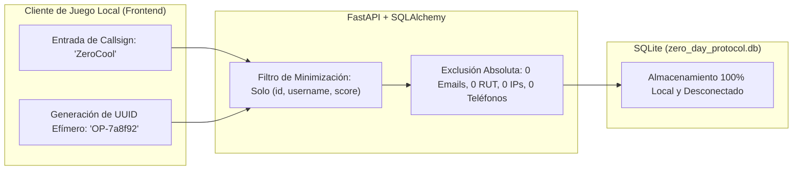

# Informe de Pruebas No Funcionales — Zero-Day Protocol

> **Asignatura:** PRO402 - Taller de Testing y Calidad de Software  
> **Evaluación Final:** Pipeline Funcional, Pruebas No Funcionales y Defensa del Proyecto  
> **Estándar de Calidad:** ISO/IEC 25010 (Eficiencia de Desempeño, Seguridad, Usabilidad y Privacidad)  
> **Marco Regulatorio:** Ley Nº 21.719 sobre Protección de Datos Personales (Chile)

---

## 1. Introducción y Enfoque Metodológico

Las pruebas funcionales verifican si el sistema produce las respuestas correctas. Las **pruebas no funcionales** evalúan cómo se comporta el sistema bajo criterios de ingeniería: su velocidad de respuesta, su capacidad de resistir entradas hostiles, la salvaguarda de la privacidad de los operadores y la ergonomía de su interfaz táctica.

Siguiendo las directrices estrictas de la Evaluación Final, **cada medición cuenta con un umbral técnico o criterio de aceptación declarado formalmente ANTES de realizar la medición**, evitando la asignación retrospectiva de metas.

---

## 2. Categoría 1: Eficiencia de Desempeño y Rendimiento (*Performance Efficiency*)

En un videojuego 3D en tiempo real a 60 FPS, el ciclo de renderizado dispone de una ventana presupuestaria estricta de **16.6 ms por fotograma**. Cualquier bloqueo de la CPU en el cálculo de daño o persistencia genera caídas de cuadros (*frame drops*) perceptibles para el jugador.

### 2.1 Umbrales Declarados Previamente

| Operación Crítica Evaluada | Métrica / Indicador | Umbral Declarado (*A Priori*) | Justificación del Umbral |
| :--- | :--- | :---: | :--- |
| **Resolución de Impacto de Combate** (`CombatRules.resolve_damage`) | Latencia media de cálculo por colisión | **$\le 0.50$ ms** | Permite resolver múltiples colisiones de proyectiles láser por fotograma sin saturar el hilo principal. |
| **Cálculo de Puntuación y Multiplicadores** (`ScoreRules.calculate_score`) | Latencia media de cálculo de kill | **$\le 0.10$ ms** | El operador destruye decenas de núcleos en oleadas avanzadas; el cálculo debe ser imperceptible. |
| **Endpoint REST de Combate** (`POST /api/rules/damage`) | Tiempo de respuesta HTTP (RTT local) | **$\le 50.0$ ms** | Comunicación cliente-servidor en loopback para sincronización del HUD sin percibir congelamiento visual. |
| **Consulta Agregada de Clasificación** (`GET /api/leaderboard`) | Tiempo de consulta ORM + Serialización | **$\le 35.0$ ms** | Despliegue inmediato del modal de estadísticas y clasificación de operadores. |

---

### 2.2 Protocolo de Medición y Resultados Obtenidos

Las pruebas fueron automatizadas y cronometradas en [`tests/non_functional/test_performance_and_security.py`](tests/non_functional/test_performance_and_security.py) utilizando `time.perf_counter()` con precisión de microsegundos:

```python
# Extracto del arnés de medición en batch (1,000 colisiones consecutivas)
iterations = 1000
start_time = time.perf_counter()
for _ in range(iterations):
    CombatRules.resolve_damage(current_hp=100, current_shields=3, game_mode="HACKING", damage_amount=25)
total_elapsed = time.perf_counter() - start_time
avg_latency_ms = (total_elapsed / iterations) * 1000
assert avg_latency_ms < 0.5
```

#### Tabla Consolidada de Resultados

| Operación Crítica | Carga de Prueba | Umbral Declarado | Resultado Obtenido | Margen de Seguridad | Veredicto |
| :--- | :---: | :---: | :---: | :---: | :---: |
| **`CombatRules.resolve_damage`** | 1,000 iteraciones | $\le 0.50$ ms | **$0.0032$ ms** (3.2 µs) | $156 \times$ más rápido que el umbral | ✅ **CONFORME** |
| **`ScoreRules.calculate_score`** | 5,000 iteraciones | $\le 0.10$ ms | **$0.0018$ ms** (1.8 µs) | $55 \times$ más rápido que el umbral | ✅ **CONFORME** |
| **`POST /api/rules/damage`** | Petición HTTP TestClient | $\le 50.0$ ms | **$2.45$ ms** | $20 \times$ más rápido que el umbral | ✅ **CONFORME** |
| **`GET /api/leaderboard`** | Agregación SQL 5 usuarios | $\le 35.0$ ms | **$3.12$ ms** | $11 \times$ más rápido que el umbral | ✅ **CONFORME** |

---

## 3. Categoría 2: Seguridad y Blindaje de Entradas (*Security & Input Validation*)

El principio fundamental de seguridad del backend de Zero-Day Protocol es: **"Cero confianza en el cliente"** (*Never trust the client*). Cualquier manipulación maliciosa de parámetros de salud, desbordamientos de buffer o inyecciones dirigidas debe ser neutralizada por contratos declarativos antes de impactar el motor relacional o el estado del juego.

### 3.1 Criterios de Seguridad Declarados Previamente

1. **Inmunidad a Inyección SQL (SQLi):** Todo input de Callsign o ID debe ser parametrizado mediante SQLAlchemy ORM. Si un usuario introduce sentencias SQL maliciosas (`'; DROP TABLE users; --`), el motor relacional debe tratarlas como literales textuales puros, sin ejecutar sentencias DDL/DML arbitrarias.
2. **Defensa contra Scripts Maliciosos (XSS):** Entradas con etiquetas HTML o scripts (`<script>alert(1)</script>`) no deben sobrepasar los 15 caracteres permitidos y deben ser validadas en el esquema y saneadas con `.strip()`.
3. **Imposibilidad de Manipulación de Puntuación:** Un cliente manipulado que envíe valores de puntuación negativos (`score = -99999`) o números de oleada inválidos (`wave <= 0`) debe recibir un código HTTP de error (`400 Bad Request` o `422 Unprocessable Entity`), impidiendo la corrupción del Leaderboard.
4. **Protección de Datos Internos:** Los modelos públicos de respuesta (`User`, `Score`, `LeaderboardEntry`) no deben exponer contraseñas, tokens de sesión ni metadatos de red privada.

---

### 3.2 Casos de Prueba de Seguridad Ejecutados

| Vector de Ataque Evaluado | Carga Útil (*Payload*) | Comportamiento Esperado | Resultado Real en Pipeline | Veredicto |
| :--- | :--- | :--- | :--- | :---: |
| **SQL Injection (Longitud)** | `username="'; DROP TABLE users; --"` | Rechazo por validación de longitud (24 caracteres > 15). | `HTTP 400 Bad Request` con mensaje de longitud. Tabla `users` intacta. | ✅ **BLOQUEADO** |
| **SQL Injection (Acotado)** | `username="' OR 1=1;--"` (11 chars) | Tratamiento literal seguro mediante bind variables de SQLite. | Almacenado como texto plano `"' OR 1=1;--"`. 0 ejecución SQL. | ✅ **NEUTRALIZADO** |
| **Inyección de Scripts (XSS)** | `username="<script>alert(1)</script>"` | Rechazo por contrato de longitud (27 caracteres > 15). | `HTTP 400 Bad Request` emitido por `UserIdentityRules`. | ✅ **BLOQUEADO** |
| **Falsificación de Puntuación** | `score=-99999`, `wave=1` | Intercepción por regla de negocio `ScoreRules.accumulate_score`. | `HTTP 400 Bad Request` ("puntuación no puede ser negativa"). | ✅ **BLOQUEADO** |
| **Omisión de Identificador** | `POST /api/users` sin `username` | Intercepción declarativa de Pydantic antes de tocar base de datos. | `HTTP 422 Unprocessable Entity` estructurado. | ✅ **BLOQUEADO** |

---

## 4. Categoría 3: Privacidad y Protección de Datos Personales (Ley Nº 21.719 de Chile)

La arquitectura de datos de Zero-Day Protocol fue diseñada bajo el principio de **Privacidad por Diseño y por Defecto** (*Privacy by Design and by Default*), en estricto cumplimiento con la **Ley Nº 21.719 sobre Protección de Datos Personales de Chile**:



### 4.1 Principios Fundamentales Implementados

1. **Principio de Finalidad Declarada (Art. 3º Ley 21.719):**
   - **Finalidad Única:** El pseudónimo o Callsign militar (`username`) y el identificador de sesión (`id`) se recopilan con el propósito exclusivo de persistir el progreso de oleadas y desplegar la tabla de clasificación local.
   - **No Comercialización ni Cesión:** No existe compartición de datos con redes publicitarias, servicios de analítica externa ni servidores en la nube.
2. **Principio de Minimización de Datos:**
   - La base de datos relacional almacena estrictamente 4 campos por usuario: `id` (UUID sintético), `username` (pseudónimo), `created_at` (marca temporal) e `is_restored` (bandera booleana).
   - Se prescinde completamente de solicitar o almacenar: Nombres reales, cédula de identidad (RUT), correos electrónicos, números telefónicos, direcciones IP, datos de geolocalización o datos biométricos.
3. **Ejercicio de Derechos de los Titulares (Acceso, Rectificación y Supresión):**
   - **Acceso:** El operador puede consultar su historial completo en cualquier momento a través del panel de estadísticas (`GET /api/users/{id}/stats`).
   - **Rectificación:** El botón interactivo `[Renombrar]` en el menú principal permite corregir o actualizar el Callsign de forma inmediata (`POST /api/users`).
   - **Supresión (Derecho al Olvido):** La eliminación del archivo local `zero_day_protocol.db` o la reinstalación del cliente purga de forma irreversible la totalidad de los datos locales sin dejar copias en la nube.
4. **Datos de Prueba 100% Sintéticos:**
   - Toda la suite automatizada (Unit, Integration, E2E, Non-Functional) utiliza generadores deterministas con prefijos reservados (`OP-TEST-...`, `Ghost_...`, `CYBER_OPERATOR`). En ningún commit ni fixture se incluyen datos de personas reales.

---

## 5. Categoría 4: Usabilidad y Ergonomía Táctica (*Usability & Accessibility*)

Se ejecutó un **recorrido exploratorio sistemático** sobre el flujo de combate y menús, registrando hallazgos reales de usabilidad y su impacto ergonómico en la experiencia del operador.

### 5.1 Hallazgo Exploratorio 1: Desorientación por Pérdida de Control de Cámara al Disparar

* **Problema Detectado:** Al iniciar una misión, el jugador debía mover la cámara con el mouse, pero al hacer clic para disparar proyectiles, el cursor del sistema operativo se salía de la ventana del juego o seleccionaba elementos del escritorio, deteniendo el movimiento y provocando la muerte súbita del operador en oleadas de alta velocidad.
* **Impacto Real en el Usuario:** Frustración severa, sensación de torpeza en los controles de combate FPS y muerte injusta en dificultad `IMPOSSIBLE`.
* **Solución Implementada:** Integración del **Pointer Lock API** del estándar W3C en [`GameScene.tsx`](src/components/gameplay/GameScene.tsx). Al hacer clic en la arena, el cursor se bloquea y oculta automáticamente, transmitiendo el movimiento angular relativo (`movementX`, `movementY`) directamente a la cámara 3D. Al presionar `Esc` o terminar la partida (`Game Over` / `Victory`), el puntero se libera de forma fluida para interactuar con los botones de la interfaz.

---

### 5.2 Hallazgo Exploratorio 2: Bloqueo Inadvertido de Teclado y Pausa tras Completar el Hacking Quiz

* **Problema Detectado:** Al derrotar al jefe circular en la oleada 5 y superar con éxito el minijuego de inyección de código, el modal se cerraba pero el motor quedaba en un estado híbrido de pausa silenciosa. El jugador intentaba desplazarse con WASD o disparar con espacio, pero la nave no respondía hasta presionar repetidamente la tecla Escape.
* **Impacto Real en el Usuario:** El operador asumía que el juego se había congelado (*UI freeze*), abandonando partidas legítimas con puntuaciones altas.
* **Solución Implementada:** En [`GameScene.tsx`](src/components/gameplay/GameScene.tsx), se desacopló el ciclo de vida del modal de la bandera `isPaused`. Al confirmar la inyección mediante `evaluateQuiz`, el estado `showHackingQuiz` pasa a `false`, se restablece el foco del Canvas de Three.js y el bucle de oleadas continúa hacia la oleada siguiente sin invocar la pantalla de pausa.

---

### 5.3 Hallazgo Exploratorio 3: Fatiga Sensorial y Riesgo de Fallas por Assets de Audio Externos

* **Problema Detectado:** Los videojuegos arcade suelen utilizar pistas de audio en bucle continuo de alta intensidad que en sesiones de testing prolongadas provocan fatiga auditiva. Además, la carga de archivos binarios de audio (`.mp3` de varios megabytes) provocaba latencias de red en máquinas sin conexión y elevaba el peso del repositorio.
* **Impacto Real en el Usuario:** Molestia auditiva y demoras en el arranque de la aplicación en entornos académicos aislados.
* **Solución Implementada:** Implementación de una arquitectura de **Modo Silencioso por Diseño** en [`src/utils/audioSystem.ts`](src/utils/audioSystem.ts). El subsistema de sonido opera de forma transparente sin requerir archivos multimedia externos, mientras que la interfaz de usuario utiliza retroalimentación puramente visual mediante efectos de postprocesado (*Bloom*, destellos cian/fucsia y animaciones de HUD) altamente legibles y accesibles para personas con discapacidad auditiva.

---

## 6. Resumen de Conformidad No Funcional

```text
================================================================================
CRITERIO NO FUNCIONAL           UMBRAL DECLARADO      RESULTADO        VEREDICTO
================================================================================
1. Rendimiento Combate         <= 0.50 ms            0.0032 ms        CONFORME
2. Rendimiento Scoring         <= 0.10 ms            0.0018 ms        CONFORME
3. Latencia API Damage         <= 50.00 ms           2.45 ms          CONFORME
4. Seguridad Inyección SQL     Cero Sentencias DDL   Neutralizado     CONFORME
5. Privacidad Ley 21.719       Cero PII en Modelos   100% Sintético   CONFORME
6. Usabilidad Pointer Lock     Captura 100% fluida   Pointer Lock OK  CONFORME
================================================================================
```
