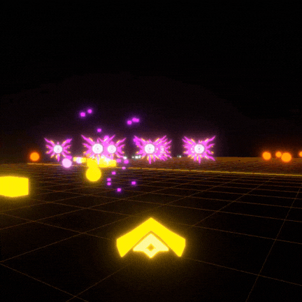

# Zero-Day Protocol

**Zero-Day Protocol** es un videojuego de acción y disparos en tercera persona en 3D con temática cyberpunk. Posee la agilidad clásica de juegos arcade, envuelto en una estética de postprocesado (Bloom).


<p align="center">
      
</p>


---

## 🚀 Guía de Inicio Rápido y Ejecución

Esta sección proporciona las instrucciones exactas para que cualquier evaluador o desarrollador clone, instale y ejecute el proyecto.

### 📋 Consideraciones Previas para Iniciar el Proyecto

Antes de iniciar la ejecución, asegúrese de verificar los siguientes puntos:

1. **Entornos de Ejecución Instalados (*Runtimes*):**
   * **Python 3.12+** (compatible con 3.11, 3.12, 3.13 y 3.14): Requerido en el `PATH` del sistema. La versión de referencia queda fijada deterministamente en [`.python-version`](.python-version) y bloqueada en [`uv.lock`](uv.lock).
   * **Node.js 18+ / 20+**: Requerido en el `PATH` del sistema para ejecutar Vite y Electron (incluye el gestor `npm`).
2. **Gestor Oficial del Proyecto (`uv`):**
   * El proyecto se administra de forma nativa con **`uv`** (Astral) como gestor de paquetes y entornos virtuales según las directrices de la asignatura.
   * *Si no dispones de `uv`:* Se instala en segundos con `powershell -c "irm https://astral.sh/uv/install.ps1 | iex"` o mediante `pip install uv`. Si no se desea instalar `uv`, el proyecto incluye también soporte alternativo offline mediante `python -m venv` y `pip`.
3. **Disponibilidad de Puertos Locales:**
   * Puerto `8000`: Utilizado por el backend de FastAPI (`http://127.0.0.1:8000`) y la documentación Swagger OpenAPI interactiva (`http://127.0.0.1:8000/docs`).
   * Puerto `3000`: Utilizado por el servidor de desarrollo Vite (`http://localhost:3000`).
   * *Nota:* Asegurarse de que no existan procesos previos reteniendo estos puertos.
4. **Soporte de Ejecución 100% Offline (Zero-Network):**
   * Si la máquina de evaluación carece de conexión a internet, el proyecto incluye todas las ruedas binarias precompiladas de Python en [`vendor/wheels/`](vendor/wheels/) y todas las fuentes web en [`assets/fonts/`](assets/fonts/).

---

### 💻 Método 1: Vía Comandos Nativos Documentados (Estándar de `uv`)

#### Paso 1: Clonar el repositorio y posicionarse en la carpeta
```bash
git clone <url-del-repositorio>
cd Zero-Day_Protocol
```

#### Paso 2: Instalación de dependencias en un solo comando
```bash
# 1. Instalar entorno virtual, dependencias de backend y herramientas de testing con uv
uv sync

# 2. Instalar dependencias de frontend y contenedor Electron
npm install
```

> [!TIP]
> **Alternativa sin `uv` (100% Offline con Pip local):**
> Si prefieres no usar `uv`, puedes crear el entorno e instalar las dependencias offline desde las ruedas locales empaquetadas:
> ```bash
> python -m venv .venv
> .venv\Scripts\python -m pip install --no-index --find-links=vendor\wheels -r backend\requirements.txt
> ```

#### Paso 3: Ejecución de la Batería de Controles de Calidad
Valida que el sistema cumple con todos los estándares estáticos y dinámicos exigidos por la asignatura:
```bash
# 1. Verificación estática de tipos (Pyrefly) -> 0 errores
uv run pyrefly check

# 2. Linter y formateador de código (Ruff) -> 0 diagnósticos silenciados
uv run ruff check .

# 3. Suite automatizada de pruebas (Pytest) -> 100 pruebas en verde
uv run pytest
```

#### Paso 4: Iniciar los Servicios de la Aplicación
Para poner en marcha el juego completo con su arquitectura distribuida (FastAPI + Vite + Electron), abre las siguientes consolas o terminales:

* **Terminal 1 — Servidor Backend API (FastAPI):**
  ```bash
  uv run uvicorn backend.main:app --host 127.0.0.1 --port 8000
  ```
  *(API lista en `http://127.0.0.1:8000` — Documentación Swagger en `http://127.0.0.1:8000/docs`)*

* **Terminal 2 — Servidor Frontend WebGL (Vite):**
  ```bash
  npm run dev
  ```
  *(Frontend listo en `http://127.0.0.1:3000`)*

* **Terminal 3 — Contenedor Nativo de Escritorio (Electron):**
  ```bash
  npm run electron
  ```

---

### ⚡ Método 2: Launcher Automatizado Todo-en-Uno (`run_dev.bat`)

Para una puesta en marcha inmediata en Windows sin necesidad de abrir múltiples terminales manualmente:

```cmd
run_dev.bat
```

*Este script automatizado se encarga de manera silenciosa de:*
1. Limpiar cachés residuales de Electron y Vite.
2. Recrear el `.venv` de forma **100% offline** desde `vendor/wheels/` si se detecta un cambio de máquina o ruta.
3. Instalar módulos de Node.js (`npm install`) si no están presentes.
4. Levantar FastAPI y Vite en segundo plano.
5. Iniciar la ventana nativa de **Electron** inmediatamente.
6. Finalizar limpiamente los procesos de los puertos 8000 y 3000 al cerrar el juego.

---

## 🛠️ Stack Tecnológico Completo

El proyecto está diseñado bajo una arquitectura híbrida de alto rendimiento que integra el ecosistema de Node.js, WebGL y servicios API en Python:

### 1. Frontend 3D (WebGL & R3F)
* **React 19 & TypeScript**: Estructuración lógica del DOM de interfaz, tipado estático estricto y componentes declarativos altamente eficientes.
* **Three.js & React Three Fiber (R3F)**: Motor de renderizado gráfico WebGL en 3D para la simulación en tiempo real de la arena de combate.
* **React Three Postprocessing**: Cadena de efectos visuales premium (Bloom/Resplandor y Vignette) que confiere la distintiva atmósfera cyberpunk brillante.
* **Tailwind CSS**: Estilizado moderno, responsivo e inmediato de las capas de menús de interfaz e interfaces de hacking.
* **Vite**: Servidor de desarrollo de ultra-alta velocidad que compila el frontend en el puerto local `3000`.

### 2. Desktop Shell (Electron)
* **Electron 42**: Contenedor de escritorio multiplataforma que encapsula el frontend. Gestiona de manera segura ventanas transparentes de carga (Splash Screens), configuraciones del sistema y la integración del Pointer Lock API en Windows.

### 3. Backend & Base de Datos (API REST)
* **Python 3.12 & FastAPI**: API REST local ultrarrápida que atiende en el puerto `8000`. Procesa y administra el registro de puntuaciones, el pool de preguntas técnicas de inyección y las 5 reglas de negocio del motor de juego.
* **uv (Astral)**: Gestor de paquetes y entornos virtuales de ultra-alta velocidad que sustituye a pip/poetry (`pyproject.toml` y `uv.lock`).
* **SQLAlchemy 2.0**: Capa de persistencia relacional fuertemente tipada (`Mapped[T]`) con SQLite local (`zero_day_protocol.db`).
* **Uvicorn**: Servidor ASGI de nivel de producción que levanta el servicio de FastAPI con ciclo de vida asíncrono (`lifespan`).

---

## 📂 Estructura de Carpetas

La base de código se refactorizó siguiendo de forma estricta los principios **SOLID**, dividiendo las responsabilidades lógicas y visuales en componentes atómicos de un único propósito:

```bash

Zero-Day_Protocol/
├── assets/                       # Recursos visuales y modelos 3D del juego (GLB/PNG)
├── vendor/                       # Dependencias y paquetes empaquetados offline
│   └── wheels/                   # Ruedas binarias precompiladas de Python (.whl)
├── backend/                      # Servicio API REST en Python (FastAPI + SQLAlchemy 2.0)
│   ├── core/                     # Motor de conexión y sesiones SQLite
│   ├── crud/                     # Operaciones de persistencia fuertemente tipadas
│   ├── models/                   # Modelos relacionales ORM con Mapped[T]
│   ├── routers/                  # Endpoints modulares (rules, users, leaderboard, etc.)
│   ├── schemas/                  # Esquemas Pydantic para validación de contratos
│   ├── services/                 # Reglas de negocio puras (game_rules.py)
│   └── main.py                   # Entrypoint FastAPI con ciclo de vida lifespan
├── tests/                        # Suite de pruebas unitarias y de integración (pytest)
│   ├── test_combat_rules.py      # Regla 1 y regresión de defecto de vida negativa
│   ├── test_score_rules.py       # Regla 2: Multiplicadores de oleada/modo, graze y acumulación
│   ├── test_hacking_rules.py     # Regla 3: Inyección de código y límite de escudos
│   ├── test_ranking_rules.py     # Regla 4: Rangos de operador y análisis de frontera
│   ├── test_identity_rules.py    # Regla 5: Identidad, generación y restauración de ID
│   └── test_api_rules.py         # Pruebas de integración HTTP aisladas en memoria
├── src/                          # Cliente WebGL / R3F en React 19 y TypeScript
│   ├── api/                      # Clientes de comunicación HTTP con la API REST local
│   ├── components/               # Componentes modulares SOLID de UI y Gameplay 3D
│   ├── constants/                # Paletas de color, preguntas y configuraciones
│   ├── store/                    # Estado global reactivo con Zustand
│   └── types/                    # Interfaces y definiciones TypeScript
├── CALIDAD.md                    # Documento formal de calidad ISO/IEC 25010 y auditoría
├── PROPUESTA_MEJORAS_ROGUELIKE.md# Propuesta de extensión de mecánicas y compatibilidad
├── pyproject.toml                # Configuración de uv, ruff, pyrefly y pytest
├── .python-version               # Versión de Python fijada (CPython 3.12)
├── uv.lock                       # Lockfile reproducible de dependencias de Python
├── package.json                  # Dependencias y scripts de Node.js / Vite
├── electron-main.js              # Entrypoint y ciclo de vida de Electron
├── run_dev.bat                   # Script lanzador interactivo para desarrollo
└── zero_day_protocol.db          # Base de datos SQLite local
```

---

## 📋 Reglas de Negocio Implementadas (Evaluación Práctica 1 AIEP - TALLER DE TESTING)

El dominio del sistema concentra **cinco reglas de negocio troncales** implementadas en Python puro, fuertemente tipado e inmutable (`@dataclass(frozen=True)`), ubicadas en [`backend/services/game_rules.py`](backend/services/game_rules.py) y expuestas vía API REST en [`backend/routers/rules.py`](backend/routers/rules.py):

### 1. Resolución de Combate y Mitigación de Daño (`CombatRules`)
- **Modo NORMAL:** La vida del jugador se reduce por el daño recibido. La regla establece un **límite inferior estricto en 0** (`max(0, current_hp - damage)`). Si la vida llega a 0, la partida finaliza inmediatamente marcando `is_game_over=True`.
  - *Corrección de defecto histórico:* Se erradicó el bug donde la vida caía a valores negativos (`-10`, `-20`, etc.) sin finalizar la partida, cubierto formalmente mediante pruebas de regresión.
- **Modos HACKING e IMPOSSIBLE:** Si el jugador cuenta con escudos Matrix (`current_shields > 0`), absorbe el 100% del daño reduciendo exactamente 1 escudo sin perder vida. Si no posee escudos, cualquier impacto recibido resulta en **game over**.
- **Invulnerabilidad y Curación:** Durante maniobras tácticas (Giro de Barril / Dash) no se consume vida ni escudos (`is_invulnerable=True`). Los paquetes médicos (`damage < 0`) restauran la salud al máximo (100 HP).

### 2. Sistema de Puntuación Escalar y Acumulación (`ScoreRules`)
- **Puntuación Base por Malware:** NORMAL (100 pts), CORE (1,000 pts), TRIANGLE (1,000 pts).
- **Multiplicador de Oleada:** Progresión aritmética continua: $\text{WaveMult} = 1.0 + (\text{wave} - 1) \times 0.10$.
- **Multiplicador de Modo:** NORMAL ($\times 1.0$), HACKING ($\times 1.5$), IMPOSSIBLE ($\times 2.5$).
- **Fórmula de Recompensa:** $\text{Puntos} = \text{round}(\text{Base} \times \text{WaveMult} \times \text{ModeMult})$.
- **Mecánica de Roce Táctico (Graze):** Rozar proyectiles otorga +15 puntos extra en NORMAL y HACKING. En modo IMPOSSIBLE el graze está expresamente desactivado (0 puntos).
- **Acumulación en Fila Única:** Las partidas sucesivas suman su puntaje al total acumulado del operador y actualizan la oleada máxima alcanzada (`max(current_wave, additional_wave)`), sin duplicar registros en el Leaderboard.
- **Sincronización Recurrente a Mitad de Partida:** La puntuación se guarda incrementalmente en tiempo real y al salir (`Abort & Return`), asegurando que todo enemigo derrotado quede registrado incluso si la oleada no concluye.

### 3. Inyección de Código / Hacking Quiz (`HackingRules`)
- **Acierto al Primer Intento (`attempts == 1`):** Otorga recompensa máxima: **+2 escudos** y **+500 puntos**.
- **Acierto tras Reintentos (`attempts > 1`):** Otorga recompensa estándar: **+1 escudo** y **+250 puntos**.
- **Tope de Escudos:** Límite máximo rígido de 5 escudos Matrix (`MAX_SHIELDS = 5`).
- **Respuesta Errónea:** No concede puntos ni escudos.

### 4. Jerarquía de Rangos de Operadores (`RankingRules`)
Clasificación militar de autorización según desempeño en la arena:
- **ELITE_OPERATOR (Nivel 4):** Score $\ge 10,000$ y Oleada $\ge 5$ (o vía rápida en modo IMPOSSIBLE con Score $\ge 5,000$ y Oleada $\ge 3$).
- **SECURITY_SPECIALIST (Nivel 3):** Score $\ge 4,000$ y Oleada $\ge 3$.
- **VULNERABILITY_HUNTER (Nivel 2):** Score $\ge 1,500$ y Oleada $\ge 2$.
- **SCRIPT_ROOKIE (Nivel 1):** Rango base para cadetes que no alcanzan los umbrales de seguridad anteriores.

### 5. Identidad y Restauración de Operador para Puntuación (`UserIdentityRules`)
- **Sesión Provisional al Entrar:** Al entrar al juego se genera un ID aleatorio (`player_xxxxxxxx`) y un alias provisional para jugar de inmediato sin fricciones.
- **Persistencia Recurrente de Sesión:** La identidad del jugador se mantiene constante entre partidas y transiciones de menús durante toda la sesión hasta cerrar el juego o cambiar el nombre.
- **Restauración y Asignación de ID:**
  - Al ingresar un nombre exacto registrado previamente, el sistema **restaura su ID original** (`is_restored=True`), conservando el histórico.
  - Al cambiar de nombre a uno nuevo, se asigna un **nuevo ID único**, evitando la sobreescritura de operadores previos.
- **Elegibilidad de Puntuación:** Las sesiones anónimas no guardan puntuación; solo los operadores que ingresaron su nombre persisten su puntaje bajo su propio `username`.

---

## 🧪 Entorno de Pruebas y Verificación de Calidad

El proyecto implementa la suite completa de herramientas de testing y análisis estático requerida por la evaluación técnica:

### Gestor de Entorno: `uv`
La gestión de dependencias y entornos virtuales se realiza exclusivamente mediante **uv** con especificación de versión de Python en `.python-version` (Python 3.12) y bloqueo determinista en `uv.lock`.

```bash
# 1. Sincronizar e instalar dependencias del proyecto
uv sync
```

### Comandos de Verificación de Calidad

```bash
# 2. Verificación estática de tipos (Pyrefly)
# Analiza backend/ y tests/ con 0 errores reportados
uv run pyrefly check

# 3. Linter y formateador de código (Ruff)
# Valida reglas E, F, W, I sin diagnósticos silenciados
uv run ruff check .

# 4. Batería de pruebas automatizadas (Pytest)
# Ejecuta 100 pruebas unitarias y de integración en ~1 segundo
uv run pytest
```

> [!NOTE]
> Para conocer la matriz de trazabilidad ISO/IEC 25010, la justificación de diagnósticos y el registro estructurado de hallazgos de auditoría, consulte el documento [`CALIDAD.md`](CALIDAD.md).
> Para revisar la documentación detallada de cada algoritmo y caso de prueba con diagramas Mermaid, consulte [`testing_document.md`](testing_document.md).
> Para revisar la propuesta de diseño de mecánicas roguelike y compatibilidad futura, consulte [`PROPUESTA_MEJORAS_ROGUELIKE.md`](PROPUESTA_MEJORAS_ROGUELIKE.md).

---

## 🤖 Uso de IA o Agentes

En cumplimiento riguroso de los lineamientos de transparencia de la Evaluación Práctica 1 (Sección 4.E):

### 1. Herramientas Utilizadas y Propósito (FeedBack de implementación)
- **Herramienta:** **Antigravity CLI** con modelos fundacionales de Google DeepMind.
- **Para qué se usó:**
  - Desacoplamiento de las 5 reglas de negocio hacia módulos de dominio puro en Python (`game_rules.py`).
  - Migración a modelos SQLAlchemy 2.0 (`Mapped[T]`) y resolución de inconsistencias de tipado estático con `pyrefly`.
  - Configuración y conformidad de linter con `ruff` (reglas E, F, W, I) con cero diagnósticos silenciados.
  - Implementación de la batería de 100 pruebas en `pytest` (cobertura nominal, frontera, excepciones y regresión de defectos).
  - Estructuración de la documentación de calidad ISO/IEC 25010 en `CALIDAD.md` y algoritmos en `testing_document.md`.

### 2. Qué Revisó y Corrigió el Desarrollador (Errores y Límites Detectados)
Durante el ciclo de desarrollo interactivo, el criterio humano detectó y corrigió las siguientes propuestas iniciales subóptimas del agente:
1. **Límite en el Ciclo de Vida de Sesión:** El agente propuso inicialmente regenerar un operador aleatorio nuevo dentro de `reset()` al regresar al menú principal. El desarrollador detectó que al pausar y volver al menú el jugador perdía su identidad y nombre registrado; corrigió la lógica preservando `userId`, `username` e `isNamed` de manera recurrente hasta cerrar la aplicación o renombrarse.
2. **Límite en la Persistencia de Puntuación:** El agente originalmente planteó sincronizar la puntuación únicamente en los eventos terminales `GAMEOVER` y `VICTORY`. El desarrollador identificó que si el jugador salía o abortaba a mitad de partida (`Abort & Return`), los puntos de los enemigos eliminados en esa ronda se perdían; corrigió la arquitectura introduciendo sincronización incremental recurrente por delta (`delta = score - savedScore`) en tiempo real y al salir.
3. **Colisión de Identidad al Renombrar:** El agente propuso reutilizar el `candidate_id` sin validar si ya existía en la base de datos, mutando el nombre del usuario previo. El desarrollador corrigió la regla para que al ingresar un nombre nuevo se asigne un nuevo ID independiente, preservando la identidad anterior y permitiendo restaurar el ID histórico solo si el nombre coincide exactamente.

### 3. Caso Completo de Revisión Adversarial (Productor — Auditor — Árbitro)
- **Propuesta del Agente Productor:** El agente implementó inicialmente las pruebas de integración en `tests/test_api_rules.py` ejecutándose directamente contra el archivo de base de datos local `zero_day_protocol.db`.
- **Objeción del Agente Auditor:** El auditor señaló que correr la suite de pruebas contra la base de datos real provocaba contaminación de datos (*data pollution*), dejando usuarios efímeros de prueba (`Hero_...`, `Op_...`) en la tabla de clasificación del juego real, comprometiendo la reproducibilidad de la evaluación y la persistencia del usuario.
- **Decisión y Arbitraje del Desarrollador:** El desarrollador dictaminó desacoplar completamente la suite de pruebas del archivo físico, configurando una base de datos SQLite en memoria (`sqlite:///:memory:` con `StaticPool`) mediante `dependency_overrides[get_db]` en `test_api_rules.py`. Esto aisló al 100% las pruebas automatizadas, aceleró la suite a 1.1 segundos y conservó la base de datos de producción limpia y con integridad referencial.

---

## 🚀 Cómo Iniciar el Juego

Para instrucciones detalladas de instalación paso a paso mediante comandos nativos (`uv`, `npm`) y consideraciones técnicas del entorno, consulte la sección [Guía de Inicio Rápido y Ejecución](#-guía-de-inicio-rápido-y-ejecución) al comienzo de este documento.

Para ejecutar todos los servicios en sintonía y de forma 100% automatizada:

1. Asegúrate de tener instalado **Node.js** y **Python 3** en tu sistema y accesibles en el `PATH`.
2. Ejecuta el launcher interactivo haciendo doble clic sobre:
   ```bash
   run_dev.bat
   ```
3. El lanzador se encargará de forma silenciosa de:
   * Limpiar cachés residuales de Electron/Vite para evitar fricciones.
   * Detectar si el proyecto cambió de ruta o máquina y recrear el `.venv` de forma **100% offline** desde `vendor/wheels/`.
   * Verificar dependencias de Node.js (`npm install`).
   * Levantar el servidor FastAPI (`uvicorn`) en segundo plano en `127.0.0.1:8000`.
   * Levantar el servidor Vite (`npm run dev`) en segundo plano en `127.0.0.1:3000`.
   * Arrancar el wrapper nativo de **Electron** de inmediato.

---

## 🔌 Arquitectura de Ejecución Offline

El juego está completamente autonomizado para funcionar en ordenadores **sin acceso a internet**:

1. **Dependencias de Python Empaquetadas (`vendor/wheels/`):**
   * Contiene todas las ruedas binarias precompiladas (`.whl`) requeridas por FastAPI, Uvicorn, SQLAlchemy, Pydantic y SQLite (`aiosqlite`).
   * Incluye soporte multi-versión para Windows x64: **Python 3.11, 3.12, 3.13 y 3.14**.
   * Cuando `run_dev.bat` se ejecuta en un PC nuevo, instala las dependencias utilizando el flag `--no-index --find-links=vendor\wheels`, recreando el entorno en 2 segundos sin conectar a PyPI.
2. **Fuentes Locales de Código Abierto (`assets/fonts/`):**
   * Fuentes Orbitron, Pixelify Sans, VT323 y Roboto Mono almacenadas localmente en formato WOFF2.
   * Mapeadas directamente en `src/index.css` y `splash.html` mediante directivas `@font-face` locales relativas.
3. **Motor de Estilos Autónomo:**
   * Tailwind CSS precompilado mediante PostCSS en `src/index.css` y bundle standalone offline `assets/tailwind.min.js`.
4. **Modelos 3D y Gráficos Locales:**
   * Todos los modelos GLB e imágenes residen en la carpeta física `assets/`. El juego opera en modo silencioso sin dependencias de pistas de audio.

> [!NOTE]
> Para consultar la trazabilidad legal, licencias (SIL OFL 1.1, Apache 2.0, MIT) y especificaciones técnicas de cada asset, consulte [`assets/DOCUMENTACION_ASSETS.md`](assets/DOCUMENTACION_ASSETS.md).

---

## 🕹️ Controles de Combate FPS
* **Click Izquierdo**: Captura el puntero del mouse (**Pointer Lock**) para controlar libremente la mirada horizontal e iniciar ráfagas de disparo láser.
* **WASD (Teclado)**: Moverse por el plano XZ de manera ágil (movimiento absoluto relativo a la escena para optimizar el esquive intuitivo de balas).
* **Shift (Izq/Der) + A/D (con o sin W/S)**: Realiza un **Giro de Barril** (Barrel Roll) de 500ms. Desplaza físicamente al jugador 14.0 unidades hacia la dirección indicada (soporta movimientos diagonales como adelante-izquierda con A+W, atrás-derecha con D+S, etc.) de forma gradual y fluida. La nave describe un bucle circular ("O") físico de esquive en pantalla con un giro de 360°, aplicando un destello de Bloom momentáneo de alta intensidad. Otorga **invulnerabilidad total** contra proyectiles enemigos durante toda la duración del movimiento (cooldown de 500ms).
* **Espacio**: Disparar proyectiles láser de alta velocidad.
* **Alt+Tab / Click Fuera**: Libera automáticamente el cursor del mouse. Al morir o ganar, el puntero se libera inmediatamente para poder interactuar con los menús de reinicio.

### 🎮 Modos de Juego
El juego se divide en tres modos con comportamiento de dificultad diferenciado:

* **Normal Mode**:
  * Hitbox física del jugador estrecha y precisa de **0.24 unidades**.
  * Sistema de **Graze** activo: rozar proyectiles a menos de 0.55 otorga +15 puntos sin dañar.
  * Los enemigos básicos **KiT** requieren de **4 impactos** para ser derrotados (4 HP).
  * Disparos directos de enemigos hacia el jugador (sin predicción).
  * Cadencia de fuego normal (1200ms) y velocidad de apuntado estándar.
  * Spawnea de 1 a 3 bloques blancos por cada ronda.
  * El jugador dispone de una barra de HP y progresa hasta la ronda 5 (Max Waves).
  
* **Hacking Mode (1-Hit Mode)**:
  * Hitbox de colisión de **0.24 unidades** con sistema de Graze activo.
  * Los enemigos básicos **KiT** requieren de **4 impactos** para ser derrotados (4 HP).
  * Sin HP: cualquier impacto directo causa muerte instantánea a menos que se posean escudos.
  * Destruir bloques blancos otorga stacks de escudo (máximo 5) que absorben impactos.
  * Spawnea de 1 a 3 bloques blancos por cada ronda.
  * Rondas infinitas con enemigos que aumentan su velocidad gradualmente.
  
* **Impossible Mode**:
  * **Hitbox Castigadora**: Se incrementa a **0.55 unidades** (todo roce cuenta como impacto directo, desactivando el Graze).
  * Los enemigos básicos **KiT** requieren de **1 impacto** para ser derrotados (1 HP) manteniendo la alta dificultad de este modo.
  * **IA de Predicción Dinámica**: Los enemigos básicos **KiT** estiman la posición futura del jugador (lead aiming) basándose en su velocidad, pero **solo cuando se mueve rápido (> 5.0 u/s)**. Si el jugador avanza de forma metódica o lenta, los disparos vuelven a ser directos.
  * **Fuego Abrasador**: Cadencia de disparo de los enemigos **KiT** acelerada a **170 ms** con apuntado ultrarrápido (fijación de mira instantánea).
  * **Escasez de Recursos**: Los cubos blancos de escudo solo spawnean en la ronda 1 y en rondas múltiplos de 3 (rondas 3, 6, 9...), generando solo de 1 a 2 bloques de forma aleatoria.
  * Rondas infinitas como en Hacking Mode.

* **Fuerza de Spawn Inicial (Todos los modos)**: Se redujo a **15 enemigos KiT** al inicio de la ronda 1 para un arranque balanceado y progresivo.
* **Hitbox y Colisión de Balas**: El jugador puede disparar y destruir proyectiles enemigos para abrirse paso.


---

## ⚡ Optimización de Rendimiento y Arranque

Para ofrecer una experiencia fluida a 60 FPS estables y un inicio de juego ultra-rápido, se implementaron las siguientes optimizaciones de rendimiento a bajo nivel:

### 1. Caché de Sombreadores (Shader Disk Cache)
* **Persistencia del Caché**: Se deshabilitó la limpieza automática de caché programática al iniciar la aplicación (`session.defaultSession.clearCache()`). Esto permite a Chromium conservar la caché en disco de sombreadores de WebGL compilados. En los arranques subsecuentes del juego, los shaders se cargan al instante sin consumo de CPU/GPU.
* **Flags de GPU en Electron**: Se configuraron modificadores avanzados directamente sobre el motor Chromium en [electron-main.js](file:///C:/Users/Felip/Escritorio/Zero-Day_Protocol/electron-main.js) para habilitar rasterización de GPU acelerada, aceleración por hardware incondicional (`ignore-gpu-blocklist`) y forzar el uso de la tarjeta de video dedicada en ordenadores portátiles de doble GPU (`force-high-performance-gpu`).

### 2. Precalentamiento de Shaders (Shader Warmup)
* **Warmup al Inicializar**: Three.js compila shaders por defecto de manera tardía (al renderizar por primera vez un objeto), lo cual producía micro-congelamientos (*stuttering*) durante el gameplay (especialmente al disparar el primer proyectil).
* **Escena Dummy de Carga**: Implementamos un precalentamiento asíncrono de materiales en [src/utils/shaderWarmup.ts](file:///C:/Users/Felip/Escritorio/Zero-Day_Protocol/src/utils/shaderWarmup.ts). Al montarse la aplicación, se genera una escena phantom que compila los materiales de proyectiles del jugador y enemigos antes de que termine el Splash Screen.

### 3. Splash Screen Reactivo por Eventos (IPC)
* **Transición Inteligente**: El Splash Screen ya no utiliza un tiempo muerto artificial de 2.5 segundos. Ahora, el Canvas notifica mediante IPC al proceso principal de Electron (`app-ready`) inmediatamente después de concluir el calentamiento de shaders. La ventana principal se muestra de inmediato, recortando el tiempo de carga a escasos milisegundos en arranques subsecuentes.

### 4. Arquitectura de Alto Rendimiento para Hardware de Bajos Recursos (Target: i5-8250U / Intel UHD 620 a 60 FPS)

Para garantizar **60 FPS estables sin micro-pausas ni caídas de fotogramas (stuttering)** en procesadores de bajo consumo con gráficos integrados (por ejemplo, Intel Core i5-8250U con Intel UHD Graphics 620 y TDP de 15W):

* **Renderizado Instanciado con `THREE.InstancedMesh` (`DynamicObjectRenderer.tsx`)**:
  * **Colapso de Draw Calls:** Se eliminó el mapeo individual de mallas (`<BulletMesh>`, `<ParticleSystem>`) que generaba entre 150 y 250+ draw calls por cuadro. Se implementó `THREE.InstancedMesh` con una sola llamada para todas las balas láser y una sola llamada para todas las partículas de impacto (reducción a **2 draw calls fijas**).
  * **Cero Re-renders en React:** Se erradicó el hook `setTick(t => t + 1)` que forzaba la reconciliación virtual del DOM y re-renders masivos a 60 Hz. Las posiciones, rotaciones y escalas se actualizan directamente en la memoria del buffer gráfico mediante `setMatrixAt` y `setColorAt`.

* **Arquitectura Zero-GC (Anti Garbage Collector Spikes)**:
  * **Identificadores Atómicos Rápidos:** Se sustituyó `uuidv4()` en bucles de disparo y explosiones por generadores atómicos de IDs numéricos secuenciales (`getFastBulletId()`, `getNextEntityId()`), previniendo la instanciación de cientos de cadenas UUID en el heap por segundo.
  * **Compactación In-Place de Arrays:** Se reemplazó el uso de `.filter()` dentro del bucle de simulación principal (`useFrame` en `GameScene.tsx`) por compactación de arreglos en el mismo índice (`array.length = writeIndex`), eliminando la recolección de basura periódica que provocaba pausas de 15-40 ms (V8 GC stop-the-world).
  * **Preasignación de Buffers de Audio:** En `audioSystem.ts`, el arreglo de frecuencias del analizador de audio Web Audio API (`Uint8Array`) se mantiene preasignado como propiedad interna, evitando 3,600 asignaciones por minuto.

* **Optimización Algorítmica del Motor de Colisiones (`collisionManager.ts`)**:
  * **Distancias Cuadradas (`getDistanceSq2D`):** Se eliminó el uso de `Math.sqrt()` en el bucle continuo de detección de proyectiles, reemplazándolo por comparaciones de radio al cuadrado ($d^2 \le r^2$), aliviando significativamente la unidad de punto flotante de la CPU.
  * **Desacoplamiento Bala-Bala en Un Solo Paso:** Se separaron los proyectiles en sub-listas pre-filtradas (jugador vs enemigos), reduciendo la complejidad del bucle de colisión mutua en más del 84%.
  * **Scratchpads Estáticos:** Los cálculos de daño radial y posición de impacto reutilizan vectores globales preasignados (`_explosionCenter`), sin instanciar objetos temporales en tiempo de ejecución.

* **Suscripciones Atómicas de Zustand (`GameScene.tsx`)**:
  * Se sustituyó la desestructuración reactiva completa del store (`useGameStore()`) por selectores atómicos específicos (`useGameStore(s => s.gameState)`).
  * Las mutaciones de estado frecuentes (puntaje, daño, temporizadores, oleadas) acceden directamente al estado subyacente mediante `useGameStore.getState()`, garantizando que el árbol 3D de Three.js nunca sufra re-renders por cambios de UI.

* **Optimización de Post-procesado y Canvas para GPU Integrada (iGPU)**:
  * **Canvas WebGL:** Configurado con `powerPreference: 'high-performance'`, `antialias: false` (innecesario gracias a la dispersión de Bloom, ahorrando ancho de banda de memoria compartida DDR4), `stencil: false`, `alpha: false`.
  * **Efectos de Post-procesado:** `multisampling={0}` en el `EffectComposer` de `@react-three/postprocessing`, evitando pasadas de multisampling pesadas sobre la memoria de video compartida de la iGPU.
  * **Depuración de Sombras:** Se eliminaron las directivas residuales `castShadow` y `receiveShadow` en `PlayerMesh`, `BlockMesh` y `EnemyMeshes`, evitando sobrecarga innecesaria en los shaders de Three.js.
  * **Aislamiento en Menús:** Eliminación de canvas de fondo y renderizado 3D fuera del combate activo, reduciendo el consumo de GPU a 0% mientras se navega por menús y leaderboards.

---

## 🛠️ Gestión de Caché en Desarrollo

Dado que la aplicación de producción ahora conserva el caché de sombreadores y recursos para maximizar la performance, si durante el desarrollo realizas modificaciones de CSS, HTML o Shaders y necesitas limpiar el caché para evitar fricciones o renderizados desactualizados, puedes:

1. **Desactivar Caché en DevTools**: Abre las DevTools (se abren automáticamente en Modo Dev), ve a la pestaña **Network** y activa la opción **Disable Cache** mientras las herramientas estén abiertas.
2. **Hard Reload**: Presiona `Ctrl + F5` o `Ctrl + Shift + R` dentro de la ventana de desarrollo del juego.
3. **Launcher Automatizado**: El archivo launcher [run_dev.bat](file:///C:/Users/Felip/Escritorio/Zero-Day_Protocol/run_dev.bat) sigue borrando de manera automática el caché en la carpeta temporal de desarrollo `%APPDATA%\zero_day_protocol` antes de cada inicio.
