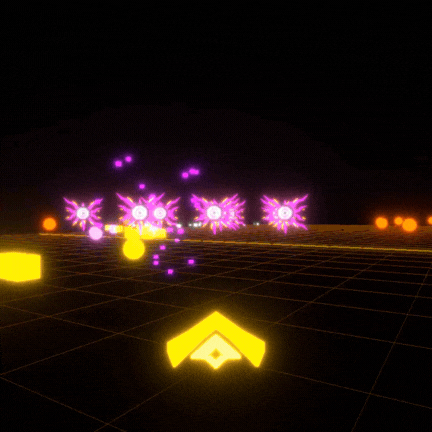

# Zero-Day Protocol

[](https://github.com/Nikolai-99/Zero-Day_Protocol/actions/workflows/ci.yml)
[](.python-version)
[](tests/)
[](PLAN-DE-PRUEBAS.md)
[](#-licencia)

**Zero-Day Protocol** es un videojuego de acción y disparos en tercera persona en 3D con temática cyberpunk. Posee la agilidad clásica de juegos arcade, envuelto en una estética de postprocesado (Bloom).


<p align="center">
      
</p>


---

## 🚀 Guía de Inicio Rápido y Ejecución

Esta sección proporciona las instrucciones exactas para que cualquier evaluador o desarrollador clone, instale y ejecute el proyecto.

### 📋 Consideraciones Previas para Iniciar el Proyecto

Antes de iniciar la ejecución, asegúrese de verificar los siguientes puntos:

1. **Entornos de Ejecución Instalados (*Runtimes*):**
   * **Python 3.12+** (compatible con 3.11, 3.12, 3.13 y 3.14): Requerido en el `PATH` del sistema. La versión de referencia queda fijada deterministamente en [`.python-version`](.python-version) y bloqueada en [`uv.lock`](uv.lock).
   * **Node.js 18+ / 20+**: Requerido en el `PATH` del sistema para ejecutar Vite y Electron (incluye el gestor `npm`).
2. **Gestor Oficial del Proyecto (`uv`):**
   * El proyecto se administra de forma nativa con **`uv`** (Astral) como gestor de paquetes y entornos virtuales según las directrices de la asignatura.
   * *Si no dispones de `uv`:* Se instala en segundos con `powershell -c "irm https://astral.sh/uv/install.ps1 | iex"` o mediante `pip install uv`. Si no se desea instalar `uv`, el proyecto incluye también soporte alternativo offline mediante `python -m venv` y `pip`.
3. **Disponibilidad de Puertos Locales:**
   * Puerto `8000`: Utilizado por el backend de FastAPI (`http://127.0.0.1:8000`) y la documentación Swagger OpenAPI interactiva (`http://127.0.0.1:8000/docs`).
   * Puerto `3000`: Utilizado por el servidor de desarrollo Vite (`http://localhost:3000`).
   * *Nota:* Asegurarse de que no existan procesos previos reteniendo estos puertos.
4. **Soporte de Ejecución 100% Offline (Zero-Network):**
   * Si la máquina de evaluación carece de conexión a internet, el proyecto incluye todas las ruedas binarias precompiladas de Python en [`vendor/wheels/`](vendor/wheels/) y todas las fuentes web en [`assets/fonts/`](assets/fonts/).

---

### 💻 Método 1: Vía Comandos Nativos Documentados (Estándar de `uv`)

#### Paso 1: Clonar el repositorio y posicionarse en la carpeta
```bash
git clone <url-del-repositorio>
cd Zero-Day_Protocol
```

#### Paso 2: Instalación de dependencias en un solo comando
```bash
# 1. Instalar entorno virtual, dependencias de backend y herramientas de testing con uv
uv sync

# 2. Instalar dependencias de frontend y contenedor Electron (reproducible y bloqueado)
npm ci
```

> [!TIP]
> **Alternativa sin `uv` (100% Offline con Pip local):**
> Si prefieres no usar `uv`, puedes crear el entorno e instalar las dependencias offline desde las ruedas locales empaquetadas:
> ```bash
> python -m venv .venv
> .venv\Scripts\python -m pip install --no-index --find-links=vendor\wheels -r backend\requirements.txt
> ```

#### Paso 3: Ejecución de la Batería de Controles de Calidad (Suite de 3 Niveles)
Valida que el sistema cumple con todos los estándares estáticos y dinámicos exigidos por la asignatura:
```bash
# 1. Verificación estática de tipos (Pyrefly) -> 0 errores
uv run pyrefly check

# 2. Linter y formateador de código (Ruff) -> 0 diagnósticos silenciados
uv run ruff check .

# 3. Nivel 1: Pruebas unitarias de reglas de dominio puro (88 pruebas en ~0.17s)
uv run pytest tests/unit

# 4. Nivel 2: Pruebas de integración de contratos API y SQLite en memoria (22 pruebas en ~0.35s)
uv run pytest tests/integration

# 5. Nivel 3: Pruebas extremo a extremo con Playwright (6 pruebas en ~25s)
uv run pytest tests/e2e

# 6. Suite unificada completa (116 pruebas en verde)
uv run pytest
```

#### Paso 4: Iniciar los Servicios de la Aplicación
Para poner en marcha el juego completo con su arquitectura distribuida (FastAPI + Vite + Electron), abre las siguientes consolas o terminales:

* **Terminal 1 — Servidor Backend API (FastAPI):**
  ```bash
  uv run uvicorn backend.main:app --host 127.0.0.1 --port 8000
  ```
  *(API lista en `http://127.0.0.1:8000` — Documentación Swagger en `http://127.0.0.1:8000/docs`)*

* **Terminal 2 — Servidor Frontend WebGL (Vite):**
  ```bash
  npm run dev
  ```
  *(Frontend listo en `http://127.0.0.1:3000`)*

* **Terminal 3 — Contenedor Nativo de Escritorio (Electron):**
  ```bash
  npm run electron
  ```

---

### ⚡ Método 2: Launcher Automatizado Todo-en-Uno (`run_dev.bat`)

Para una puesta en marcha inmediata en Windows sin necesidad de abrir múltiples terminales manualmente:

```cmd
run_dev.bat
```

*Este script automatizado se encarga de manera silenciosa de:*
1. Limpiar cachés residuales de Electron y Vite.
2. Recrear el `.venv` de forma **100% offline** desde `vendor/wheels/` si se detecta un cambio de máquina o ruta.
3. Instalar módulos de Node.js (`npm ci`) si no están presentes de manera reproducible.
4. Levantar FastAPI y Vite en segundo plano.
5. Iniciar la ventana nativa de **Electron** inmediatamente.
6. Finalizar limpiamente los procesos de los puertos 8000 y 3000 al cerrar el juego.

---

## 🛠️ Stack Tecnológico Completo

El proyecto está diseñado bajo una arquitectura híbrida de alto rendimiento que integra el ecosistema de Node.js, WebGL y servicios API en Python:

### 1. Frontend 3D (WebGL & R3F)
* **React 19 & TypeScript**: Estructuración lógica del DOM de interfaz, tipado estático estricto y componentes declarativos altamente eficientes.
* **Three.js & React Three Fiber (R3F)**: Motor de renderizado gráfico WebGL en 3D para la simulación en tiempo real de la arena de combate.
* **React Three Postprocessing**: Cadena de efectos visuales premium (Bloom/Resplandor y Vignette) que confiere la distintiva atmósfera cyberpunk brillante.
* **Tailwind CSS**: Estilizado moderno, responsivo e inmediato de las capas de menús de interfaz e interfaces de hacking.
* **Vite**: Servidor de desarrollo de ultra-alta velocidad que compila el frontend en el puerto local `3000`.

### 2. Desktop Shell (Electron)
* **Electron 42**: Contenedor de escritorio multiplataforma que encapsula el frontend. Gestiona de manera segura ventanas transparentes de carga (Splash Screens), configuraciones del sistema y la integración del Pointer Lock API en Windows.

### 3. Backend & Base de Datos (API REST)
* **Python 3.12 & FastAPI**: API REST local ultrarrápida que atiende en el puerto `8000`. Procesa y administra el registro de puntuaciones, el pool de preguntas técnicas de inyección y las 5 reglas de negocio del motor de juego.
* **uv (Astral)**: Gestor de paquetes y entornos virtuales de ultra-alta velocidad que sustituye a pip/poetry (`pyproject.toml` y `uv.lock`).
* **SQLAlchemy 2.0**: Capa de persistencia relacional fuertemente tipada (`Mapped[T]`) con SQLite local (`zero_day_protocol.db`).
* **Uvicorn**: Servidor ASGI de nivel de producción que levanta el servicio de FastAPI con ciclo de vida asíncrono (`lifespan`).

---

## 📂 Estructura de Carpetas

La base de código se refactorizó siguiendo de forma estricta los principios **SOLID**, dividiendo las responsabilidades lógicas y visuales en componentes atómicos de un único propósito:

```bash

Zero-Day_Protocol/
├── .github/                      # Automatización de Integración Continua (CI)
│   └── workflows/ci.yml          # Pipeline de GitHub Actions (checks estáticos y 4 niveles)
├── assets/                       # Recursos visuales locales (modelos 3D GLB, fuentes WOFF2, PNG)
├── vendor/wheels/                # Ruedas binarias precompiladas de Python para entorno offline
├── backend/                      # Servicio API REST en Python (FastAPI + SQLAlchemy 2.0)
│   ├── core/                     # Motor de conexión y sesiones SQLite
│   ├── crud/                     # Operaciones de persistencia fuertemente tipadas
│   ├── models/                   # Modelos relacionales ORM con Mapped[T]
│   ├── routers/                  # Endpoints modulares (rules, users, leaderboard, etc.)
│   ├── schemas/                  # Esquemas Pydantic para validación de contratos
│   ├── services/                 # Reglas de negocio puras (game_rules.py)
│   └── main.py                   # Entrypoint FastAPI con ciclo de vida lifespan
├── tests/                        # Suite automatizada en 3 niveles + pruebas no funcionales
│   ├── unit/                     # Nivel 1: Pruebas unitarias de dominio puro (88 pruebas)
│   ├── integration/              # Nivel 2: Integración API y SQLite en memoria (22 pruebas)
│   ├── e2e/                      # Nivel 3: Pruebas de interfaz E2E con Playwright (6 pruebas)
│   └── non_functional/           # Rendimiento, Seguridad y Privacidad Ley 21.719 (8 pruebas)
├── src/                          # Cliente WebGL / R3F en React 19 y TypeScript
│   ├── api/                      # Clientes de comunicación HTTP con la API REST local
│   ├── components/               # Componentes modulares SOLID de UI y Gameplay 3D
│   ├── constants/                # Paletas de color, preguntas y configuraciones
│   ├── store/                    # Estado global reactivo con Zustand
│   └── types/                    # Interfaces y definiciones TypeScript
├── CALIDAD.md                    # Matriz de trazabilidad ISO/IEC 25010 y auditoría de calidad
├── DISENO-DE-CASOS.md            # Diseño formal de casos (EP, BVA, tablas de decisión, no funcionales)
├── PLAN-DE-PRUEBAS.md            # Plan maestro de pruebas cerrado según norma ISO/IEC/IEEE 29119
├── NO-FUNCIONALES.md             # Informe formal de pruebas no funcionales con umbrales declarados
├── GAMEPLAY.md                   # Guía de mecánicas, modos de juego y controles de combate FPS
├── OPTIMIZACIONES.md             # Arquitectura del motor 3D WebGL, Zero-GC y optimizaciones iGPU
├── pyproject.toml                # Configuración de uv, ruff, pyrefly y pytest
├── .python-version               # Versión de Python fijada (CPython 3.12)
├── uv.lock                       # Lockfile reproducible de dependencias de Python
├── package.json                  # Dependencias y scripts de Node.js / Vite
├── electron-main.js              # Entrypoint y ciclo de vida de Electron
├── run_dev.bat                   # Script lanzador interactivo para desarrollo
└── zero_day_protocol.db          # Base de datos SQLite local
```

---

## 📋 Pirámide de Pruebas, Integración Continua y Cobertura (Evaluación Final)

El proyecto consolida una **arquitectura de aseguramiento de calidad automatizada en GitHub Actions** bajo el estándar **ISO/IEC/IEEE 29119**, sumando **124 pruebas automatizadas** en verde. El dominio troncal implementado en Python puro e inmutable (`@dataclass(frozen=True)` en [`backend/services/game_rules.py`](backend/services/game_rules.py)) se complementa con la verificación formal de contratos HTTP de la API REST ([`backend/routers/rules.py`](backend/routers/rules.py)), pruebas de interfaz extremo a extremo con Playwright, y pruebas no funcionales de rendimiento, seguridad y privacidad en [`NO-FUNCIONALES.md`](NO-FUNCIONALES.md):

### 1. Pirámide de Pruebas Automatizada (124 Pruebas)
- **Nivel 1 — Pruebas Unitarias (`tests/unit/`):** 88 pruebas sobre las reglas de dominio puro (`CombatRules`, `ScoreRules`, `HackingRules`, `RankingRules`, `UserIdentityRules`). Cubren particiones nominales, análisis de valores límite (BVA) y la regresión del defecto histórico de vida negativa. Ejecución ultra-rápida en ~0.17s.
- **Nivel 2 — Pruebas de Integración (`tests/integration/`):** 22 pruebas que validan los contratos HTTP de FastAPI mediante `TestClient` y una base de datos SQLite aislada en memoria (`sqlite:///:memory:` con `StaticPool`). Valida códigos de estado (200, 400, 422), esquemas Pydantic y persistencia relacional con agregación de puntajes históricos y rangos sin contaminación de datos. Ejecución en ~0.35s.
- **Nivel 3 — Pruebas Extremo a Extremo con Playwright (`tests/e2e/`):** 6 pruebas sobre el frontend real servido por Vite. Valida el recorrido de usuario (*User Journey*): carga de interfaz, renombrado de operador (*Callsign*), inicio de misión en dificultad Normal (HUD con HP 100%), adaptación del HUD a escudos Matrix en Hacking Mode, alerta de muerte a 1 golpe en Impossible Mode, visibilidad del panel de clasificación (*Leaderboard*) e interacción con la terminal interactiva de Hacking Quiz. Ejecución en ~14s.
- **Pruebas No Funcionales y Regresión (`tests/non_functional/`):** 8 pruebas especializadas con umbrales declarados previamente: latencia de combate ($\le 0.5$ ms), latencia de scoring ($\le 0.1$ ms), tiempo de respuesta HTTP ($\le 50$ ms), contención ante SQL Injection/XSS, y minimización de datos según la Ley Nº 21.719 de Chile. Ejecución en ~0.15s.

### 2. Diseño Formal de Casos de Prueba (`DISENO-DE-CASOS.md`)
- **Particiones de Equivalencia (EP):** Clasificación sistemática de entradas en rangos válidos e inválidos para salud ($[1,99], \{100\}, \{0\}, <0$), modos canónicos (`NORMAL`, `HACKING`, `IMPOSSIBLE`), daño y formato de nombre de operador.
- **Análisis de Valores Límite (BVA):** Pruebas de 3 puntos en los bordes numéricos exactos ($N-1, N, N+1$) para umbrales de rango militar (1499/1500, 3999/4000, 9999/10000 y el atajo acelerado de 4999/5000 en IMPOSSIBLE), así como bordes de salud ($0, 1, 100$).
- **Tablas de Decisión:** Derivación combinatoria exhaustiva para resolución de combate multivariante (8 reglas R1–R8 que cruzan invulnerabilidad, curación, modo de juego y escudos) y matriz de asignación de rangos (7 reglas T1–T7).

### 3. Casos de Prueba Descartados con Justificación Técnica
- **Oleada Negativa en API (`wave <= 0`):** Descartado en pruebas de integración porque el esquema declarativo Pydantic (`Field(ge=1)`) intercepta la petición con `HTTP 422 Unprocessable Entity` antes de invocar la lógica de dominio.
- **Aserción de Mallas y Partículas 3D en Playwright:** Descartado para erradicar *flaky tests* causados por la emulación de Chromium por software; se sustituyó por verificación determinista del DOM en el HUD (`System Status`, `HP 100%`, `Shield Matrix`).
- **Escudos Negativos (`current_shields < 0`):** Descartado por precondición y sanitización en `max(0, min(5, current_shields))` y la acción de Zustand `consumeShieldStack`.
- **Concurrencia Distribuida en SQLite:** Descartado por estar fuera del alcance del estándar para una arquitectura monousuario de escritorio local.

### 4. Plan Maestro de Pruebas y Trazabilidad (ISO/IEC/IEEE 29119)
- **Marco Normativo (`PLAN-DE-PRUEBAS.md`):** Definición formal de alcance de pruebas, estrategia de mitigación de riesgos de calidad (funcionalidad, contratos, UI), criterios de entrada y salida, y entornos de prueba.
- **Matriz de Trazabilidad Bidireccional:** Vinculación directa entre identificadores de caso de prueba (`TC-COMBAT-001`, `TC-RANK-001`, `TC-API-001`, `TC-E2E-001`, etc.), reglas de negocio evaluadas, técnica de diseño formal aplicada y archivos de prueba automatizados.

### 5. Consolidación de Reglas Troncales de Negocio (Dominio Base)
- **Resolución de Combate y Mitigación de Daño (`CombatRules`):** Gestión de vida, absorción de 1 escudo Matrix en HACKING/IMPOSSIBLE, muerte súbita con 0 escudos, invulnerabilidad táctica y truncamiento en 0 (piso matemático).
- **Sistema de Puntuación Escalar (`ScoreRules`):** Base por tipo de malware (100, 1000 pts), multiplicador de oleada continuo ($1.0 + (\text{wave}-1)\times 0.10$), multiplicador de dificultad (1.0x, 1.5x, 2.5x), roce táctico (*Graze* +15 pts, desactivado en IMPOSSIBLE) y acumulación histórica de puntuación.
- **Jerarquía de Rangos Militares (`RankingRules`):** Clasificación en 4 niveles de autorización (`SCRIPT_ROOKIE`, `VULNERABILITY_HUNTER`, `SECURITY_SPECIALIST`, `ELITE_OPERATOR`).
- **Identidad y Restauración de Operador (`UserIdentityRules`):** Validación de Callsign (1-15 caracteres), persistencia de sesión entre transiciones y restauración de ID histórico.

---

## 🧪 Entorno de Pruebas y Verificación de Calidad

El proyecto implementa la suite completa de herramientas de testing y análisis estático requerida por la evaluación técnica:

### Gestor de Entorno: `uv`
La gestión de dependencias y entornos virtuales se realiza exclusivamente mediante **uv** con especificación de versión de Python en `.python-version` (Python 3.12) y bloqueo determinista en `uv.lock`.

```bash
# 1. Sincronizar e instalar dependencias del proyecto
uv sync
```

### Comandos de Verificación de Calidad

```bash
# 2. Verificación estática de tipos (Pyrefly)
# Analiza backend/ y tests/ con 0 errores reportados
uv run pyrefly check

# 3. Linter y formateador de código (Ruff)
# Valida reglas E, F, W, I sin diagnósticos silenciados
uv run ruff check .

# 4. Batería de pruebas automatizadas completa (Pytest)
# Ejecuta las 124 pruebas automatizadas en todos los niveles (Unit, Integration, E2E, Non-Functional)
uv run pytest

# 5. Ejecución selectiva de pruebas no funcionales y de seguridad
uv run pytest tests/non_functional
```

> [!NOTE]
> Para conocer la matriz de trazabilidad ISO/IEC 25010, la justificación de diagnósticos y el registro estructurado de hallazgos de auditoría, consulte el documento [`CALIDAD.md`](CALIDAD.md).
> Para revisar el diseño formal de casos de prueba (Particiones de Equivalencia, BVA y Tablas de Decisión), consulte [`DISENO-DE-CASOS.md`](DISENO-DE-CASOS.md) y [`PLAN-DE-PRUEBAS.md`](PLAN-DE-PRUEBAS.md).
> Para auditar las mediciones de latencia, defensas de inyección SQL/XSS y privacidad según la Ley 21.719, consulte [`NO-FUNCIONALES.md`](NO-FUNCIONALES.md).

---

## 🤖 Uso de IA o Agentes

En cumplimiento riguroso de los lineamientos de transparencia de las Evaluaciones Prácticas 1 y 2, y de la **Evaluación Final (Sección 3.E)**:

### 1. Herramientas Utilizadas y Propósito (FeedBack de implementación)
- **Herramienta:** **Antigravity CLI** con modelos fundacionales de Google DeepMind.
- **Para qué se usó:**
  - Desacoplamiento de las 5 reglas de negocio hacia módulos de dominio puro en Python (`game_rules.py`).
  - Migración a modelos SQLAlchemy 2.0 (`Mapped[T]`) y resolución de inconsistencias de tipado estático con `pyrefly`.
  - Configuración y conformidad de linter con `ruff` (reglas E, F, W, I) con cero diagnósticos silenciados.
  - Implementación de la batería de 124 pruebas en `pytest` (cobertura nominal, frontera, excepciones, E2E y no funcionales).
  - Estructuración de la documentación de calidad ISO/IEC 25010 en `CALIDAD.md` y diseño formal de casos en `DISENO-DE-CASOS.md`.

### 2. Qué Revisó y Corrigió el Desarrollador (Errores y Límites Detectados)
Durante el ciclo de desarrollo interactivo, el criterio humano detectó y corrigió las siguientes propuestas iniciales subóptimas del agente:
1. **Límite en el Ciclo de Vida de Sesión:** El agente propuso inicialmente regenerar un operador aleatorio nuevo dentro de `reset()` al regresar al menú principal. El desarrollador detectó que al pausar y volver al menú el jugador perdía su identidad y nombre registrado; corrigió la lógica preservando `userId`, `username` e `isNamed` de manera recurrente hasta cerrar la aplicación o renombrarse.
2. **Límite en la Persistencia de Puntuación:** El agente originalmente planteó sincronizar la puntuación únicamente en los eventos terminales `GAMEOVER` y `VICTORY`. El desarrollador identificó que si el jugador salía o abortaba a mitad de partida (`Abort & Return`), los puntos de los enemigos eliminados en esa ronda se perdían; corrigió la arquitectura introduciendo sincronización incremental recurrente por delta (`delta = score - savedScore`) en tiempo real y al salir.
3. **Colisión de Identidad al Renombrar:** El agente propuso reutilizar el `candidate_id` sin validar si ya existía en la base de datos, mutando el nombre del usuario previo. El desarrollador corrigió la regla para que al ingresar un nombre nuevo se asigne un nuevo ID independiente, preservando la identidad anterior y permitiendo restaurar el ID histórico solo si el nombre coincide exactamente.

### 3. Caso Completo de Revisión Adversarial (Productor — Auditor — Árbitro)
- **Propuesta del Agente Productor:** El agente implementó inicialmente las pruebas de integración en `tests/test_api_rules.py` (actualmente modularizadas en `tests/integration/test_api_rules.py`) ejecutándose directamente contra el archivo de base de datos local `zero_day_protocol.db`.
- **Objeción del Agente Auditor:** El auditor señaló que correr la suite de pruebas contra la base de datos real provocaba contaminación de datos (*data pollution*), dejando usuarios efímeros de prueba (`Hero_...`, `Op_...`) en la tabla de clasificación del juego real, comprometiendo la reproducibilidad de la evaluación y la persistencia del usuario.
- **Decisión y Arbitraje del Desarrollador:** El desarrollador dictaminó desacoplar completamente la suite de pruebas del archivo físico, configurando una base de datos SQLite en memoria (`sqlite:///:memory:` con `StaticPool`) mediante `dependency_overrides[get_db]` en `tests/integration/conftest.py`. Esto aisló al 100% las pruebas automatizadas, aceleró la suite a 0.5 segundos y conservó la base de datos de producción limpia y con integridad referencial.

### 4. Auditoría de Casos de Prueba Propuestos por el Agente (Evaluación Parcial 2 - Sección 3.E)
En cumplimiento estricto del criterio de criterio frente al agente de la EP2:
* **Casos Propuestos por el Agente y ACEPTADOS por el Desarrollador en la EP2:**
  1. *Rechazo estricto con HTTP 422 en esquemas Pydantic:* El agente propuso un caso de prueba de contrato que envía un `user_id` sin el campo `username` a `/api/users`, verificando que la API consumible responda con `422 Unprocessable Entity` y el detalle estructurado de validación (`test_post_user_missing_required_fields_returns_422`), blindando la API ante el Defecto 2 de la verificación en vivo.
  2. *Verificación E2E de la Terminal de Inyección / Hacking Quiz:* El agente propuso un flujo completo con Playwright (`test_e2e_hacking_quiz_modal_interaction_and_rewards`) que interactúa con la ventana modal del Quiz, selecciona un exploit y valida la entrega de escudos Matrix y puntos en el DOM de la aplicación web.
  3. *Aislamiento dinámico de BD en Playwright:* El agente propuso parametrizar `DATABASE_URL` hacia una base temporal aislada en `tests/e2e/conftest.py`, evitando la polución de `zero_day_protocol.db`.
* **Casos Propuestos por el Agente y DESCARTADOS CON FUNDAMENTO por el Desarrollador en la EP2:**
  1. *Aserción de coordenadas de mallas 3D en Playwright:* El agente propuso escribir una prueba E2E que calculara las coordenadas X, Y, Z de las partículas y mallas de los virus en el Canvas de WebGL mediante capturas periódicas.  
     **Fundamento del rechazo:** Caso descartado por ser técnicamente inviable e inestable (*flaky test*). La emulación por software de WebGL en entornos headless de Chromium no garantiza sincronización de microsegundos a 60 FPS, generando falsos negativos. El desarrollador descartó la inspección del Canvas y redirigió la prueba a la verificación determinista en el DOM del HUD reactivo (`System Status`, `HP 100%`, `Shield Matrix`) y la terminal del Quiz.
  2. *Prueba unitaria con Oleada negativa (`wave = -5`) en `ScoreRules`:* El agente propuso escribir una prueba unitaria pasando oleadas negativas a la fórmula aritmética.  
     **Fundamento del rechazo:** Caso descartado por redundancia entre capas. La precondición de entrada está rígidamente asegurada por el esquema Pydantic en FastAPI (`Field(ge=1)`) y por el store de Zustand en el cliente. Escribir pruebas repetitivas de lo mismo en múltiples capas viola el principio de la pirámide de testing (*"tres copias de lo mismo no hacen una pirámide"*).

### 5. Balance del Módulo y Criterio Técnico del Desarrollador (Evaluación Final - Requisito E)
* **Qué tareas se delegaron al agente:**
  1. Refactorización sintáctica y estricta tipificación de modelos SQLAlchemy 2.0 (`Mapped[T]`) y esquemas Pydantic.
  2. Generación combinatoria rápida de datos para particiones de equivalencia y tablas de decisión en tests unitarios.
  3. Estructuración del arnés de automatización en GitHub Actions (`.github/workflows/ci.yml`).
* **Qué se auditó rigurosamente de parte del desarrollador:**
  1. Que ninguna prueba tocara la base de datos real `zero_day_protocol.db` (aislamiento con base en memoria).
  2. Que los umbrales de latencia y rendimiento de `NO-FUNCIONALES.md` fueran fijados con base técnica *antes* de medir.
  3. Que el modelo de datos cumpliera estrictamente la Ley 21.719 chilena sin almacenar información de identificación personal.
  4. Que la interacción de Playwright fuera determinista en el DOM y no sobre mallas WebGL volátiles.
* **Qué propuestas erróneas hizo un agente durante el módulo:**
  1. *Aserción de mallas y coordenadas 3D en Playwright:* El agente intentó comparar posiciones de vértices en el Canvas WebGL; fue rechazado por provocar pruebas inestables (*flaky tests*) en runners de CI sin GPU.
  2. *Reutilización de ID de candidato al renombrar:* El agente intentó reciclar el candidate_id sin validar si ya existía en la base de datos, mutando el usuario previo. Fue rechazado y corregido para generar un UUID nuevo si el nombre no coincide exactamente.
  3. *Auto-pausa oculta tras completar el Quiz:* El agente acopló el cierre del modal de hacking a la pausa general, congelando el movimiento hasta presionar Escape. El desarrollador desacopló ambos estados en `GameScene.tsx`.
* **Qué decisiones técnicas del proyecto corresponden enteramente al desarrollador:**
  1. La adopción de la arquitectura 100% offline con ruedas locales en `vendor/wheels/` para garantizar reproducibilidad en cualquier entorno sin internet.
  2. La regla de mitigación con escudos Matrix exclusivos para los modos Hacking e Impossible, manteniendo el modo Normal basado en barra de vida clásica.
  3. La sustitución de `npm install` por `npm ci` para garantizar la inmutabilidad matemática del `package-lock.json`.
  4. La selección de la Ley 21.719 como marco de privacidad y la directiva de cero recolección de PII.

---

## 🚀 Cómo Iniciar el Juego

Para instrucciones detalladas de instalación paso a paso mediante comandos nativos (`uv`, `npm`) y consideraciones técnicas del entorno, consulte la sección [Guía de Inicio Rápido y Ejecución](#-guía-de-inicio-rápido-y-ejecución) al comienzo de este documento.

Para ejecutar todos los servicios en sintonía y de forma 100% automatizada:

1. Asegúrate de tener instalado **Node.js** y **Python 3** en tu sistema y accesibles en el `PATH`.
2. Ejecuta el launcher interactivo haciendo doble clic sobre:
   ```bash
   run_dev.bat
   ```
3. El lanzador se encargará de forma silenciosa de:
   * Limpiar cachés residuales de Electron/Vite para evitar fricciones.
   * Detectar si el proyecto cambió de ruta o máquina y recrear el `.venv` de forma **100% offline** desde `vendor/wheels/`.
   * Verificar dependencias de Node.js (`npm ci`).
   * Levantar el servidor FastAPI (`uvicorn`) en segundo plano en `127.0.0.1:8000`.
   * Levantar el servidor Vite (`npm run dev`) en segundo plano en `127.0.0.1:3000`.
   * Arrancar el wrapper nativo de **Electron** de inmediato.

---

## 🔌 Arquitectura de Ejecución Offline

El juego está completamente autonomizado para funcionar en ordenadores **sin acceso a internet**:

1. **Dependencias de Python Empaquetadas (`vendor/wheels/`):**
   * Contiene todas las ruedas binarias precompiladas (`.whl`) requeridas por FastAPI, Uvicorn, SQLAlchemy, Pydantic y SQLite (`aiosqlite`).
   * Incluye soporte multi-versión para Windows x64: **Python 3.11, 3.12, 3.13 y 3.14**.
   * Cuando `run_dev.bat` se ejecuta en un PC nuevo, instala las dependencias utilizando el flag `--no-index --find-links=vendor\wheels`, recreando el entorno en 2 segundos sin conectar a PyPI.
2. **Fuentes Locales de Código Abierto (`assets/fonts/`):**
   * Fuentes Orbitron, Pixelify Sans, VT323 y Roboto Mono almacenadas localmente en formato WOFF2.
   * Mapeadas directamente en `src/index.css` y `splash.html` mediante directivas `@font-face` locales relativas.
3. **Motor de Estilos Autónomo:**
   * Tailwind CSS precompilado mediante PostCSS en `src/index.css` y bundle standalone offline `assets/tailwind.min.js`.
4. **Modelos 3D y Gráficos Locales:**
   * Todos los modelos GLB e imágenes residen en la carpeta física `assets/`. El juego opera en modo silencioso sin dependencias de pistas de audio.

> [!NOTE]
> Para consultar la trazabilidad legal, licencias (SIL OFL 1.1, Apache 2.0, MIT) y especificaciones técnicas de cada asset, consulte [`assets/README.md`](assets/README.md).

---

## 🕹️ Mecánicas de Juego y Controles

> 📖 Para consultar la guía completa de combate, maniobras de evasión y balance de oleadas, consulte [`GAMEPLAY.md`](GAMEPLAY.md).  
> ⚡ Para la arquitectura interna del motor WebGL, renderizado instanciado, Zero-GC y optimizaciones a 60 FPS en iGPUs, consulte [`OPTIMIZACIONES.md`](OPTIMIZACIONES.md).
---

## 📄 Licencia y Atribución

Este proyecto ha sido concebido con fines puramente **educativos y experimentales**, con el objetivo de investigar y poner a prueba el potencial del entorno **Electron** combinado con tecnologías web modernas (**WebGL, Three.js, React Three Fiber y FastAPI**) para el desarrollo de videojuegos de escritorio con renderizado 3D en tiempo real y arquitectura de alto rendimiento.

### 🔓 Libertad de Uso y Modificación
Cualquier persona, estudiante o desarrollador que clone o descargue este repositorio tiene plena libertad para:
- Estudiar, ejecutar y experimentar con la base de código.
- Modificar, extender, refactorizar o adaptar cualquier componente (mecánicas de combate, shaders, motor de colisiones, interfaz o backend).
- Utilizar este proyecto como referencia técnica o base para nuevas creaciones y prototipos de juegos.

### 🏷️ Términos de Atribución
El uso y modificación de este repositorio se concede bajo la condición de realizar la **correcta atribución de autoría**:
- Conservar los créditos originales correspondientes al autor del proyecto (**Nikolai-99**).
- Incluir un enlace al repositorio original ([`https://github.com/Nikolai-99/Zero-Day_Protocol`](https://github.com/Nikolai-99/Zero-Day_Protocol)) en bifurcaciones (*forks*), proyectos derivados o publicaciones donde se reutilice total o parcialmente este trabajo.
- Respetar los términos de licenciamiento de los recursos y dependencias de terceros incluidos (SIL Open Font License 1.1, Apache 2.0 y MIT), documentados detalladamente en [`assets/README.md`](assets/README.md).

