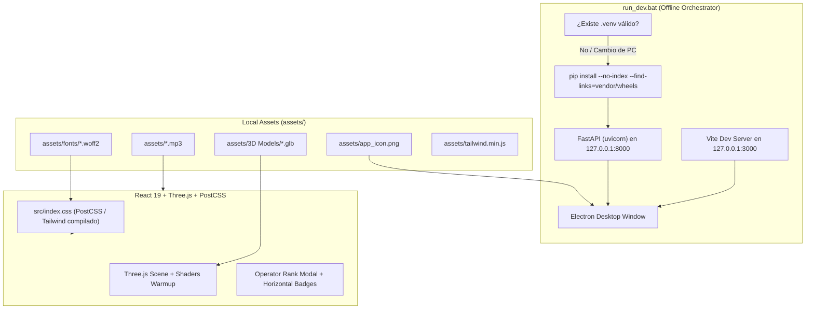

---
title: "Documentación de Recursos y Dependencias Offline (Assets)"
project: "Zero-Day Protocol"
author: "Google DeepMind Advanced Agentic Coding Pair"
date: "2026-09-07"
tags:
  - zero-day-protocol
  - assets
  - licensing
  - offline-architecture
  - cyberpunk-ui
---

# 📦 Registro y Documentación de Recursos (Assets) — Zero-Day Protocol

Esta documentación detalla la totalidad de los recursos multimedia, tipográficos, modelos 3D, librerías de estilos y dependencias empaquetadas utilizadas en **Zero-Day Protocol**. 

El proyecto ha sido diseñado bajo una estricta directiva de **arquitectura de ejecución 100% offline**, garantizando que el juego pueda inicializarse, instalar sus dependencias de entorno y renderizar todos sus componentes visuales y de audio en cualquier máquina Windows **sin conexión a internet**.

---

## 🗺️ Arquitectura de Carga Offline de Recursos



---

## 1. 🔤 Tipografías de Código Abierto (`assets/fonts/`)

Todas las fuentes han sido descargadas localmente en formato moderno **WOFF2** e integradas en `src/index.css` y `splash.html` mediante directivas `@font-face` relativas, eliminando dependencias de Google Fonts o CDNs externos.

| Recurso / Archivo | Familia | Diseñador / Origen | Licencia | Función en el Juego |
|---|---|---|---|---|
| `assets/fonts/orbitron.woff2` | **Orbitron** | Matt McInerney (The League of Moveable Type) | [SIL Open Font License 1.1](https://openfontlicense.org/) | Títulos principales, pantalla Splash, HUD de oleadas, encabezados del modal de rango de operadores. |
| `assets/fonts/pixelifysans.woff2` | **Pixelify Sans** | Stefie Justprince | [SIL Open Font License 1.1](https://openfontlicense.org/) | Rango militar de operador (`ELITE_OPERATOR`, `SECURITY_SPECIALIST`, etc.) con estética retro de píxeles nítidos. |
| `assets/fonts/vt323.woff2` | **VT323** | Peter Hull | [SIL Open Font License 1.1](https://openfontlicense.org/) | Cifras de puntuación por modo de juego en el menú y modal de estadísticas (aspecto de terminal CRT clásico). |
| `assets/fonts/robotomono.woff2` | **Roboto Mono** | Christian Robertson (Google) | [Apache License 2.0](https://www.apache.org/licenses/LICENSE-2.0) | Textos de consola técnica, estadísticas, logs del sistema y subtítulos de interfaz. |

---

## 2. 🎨 Motor de Estilos Local (`assets/` y `src/index.css`)

| Recurso / Archivo | Formato | Origen | Licencia | Función en el Juego |
|---|---|---|---|---|
| `src/index.css` | CSS Nativo compilado vía PostCSS | Tailwind Labs & Custom CSS | **MIT License** | Define el diseño visual, animaciones RGB cíclicas (`@keyframes rgbCycle`), brillo de texto (`glow`), barras de progreso y diseño flexbox del modal. |
| `assets/tailwind.min.js` | JavaScript Standalone | Tailwind Labs | **MIT License** | Bundle local minificado de Tailwind CSS para servir como respaldo offline inmediato en entornos sin compilación previa. |

---

## 3. 🛸 Modelos 3D y Gráficos Procedurales (`assets/3D Models/`)

| Recurso / Archivo | Formato | Especificación Técnica | Licencia | Función en el Juego |
|---|---|---|---|---|
| `assets/3D Models/KiT_Virus.glb` | GLTF Binary (.glb) | Malla poligonal optimizada para WebGL, sombreador emissive neón | **Uso Libre / Proyecto Propio** | Modelo 3D de la unidad de malware enemiga básica (KiT). Incluye soporte para colisiones y destrucción por disparos láser. |
| `assets/3D Models/Player_Cursor.glb` | GLTF Binary (.glb) | Malla estilizada tipo nave / cursor de hacking | **Uso Libre / Proyecto Propio** | Avatar visual de la nave del operador durante maniobras de combate y Giros de Barril (Barrel Roll). |
| `assets/app_icon.png` | PNG (1024x1024) | Gráfico de alta definición con canal alfa transparente | **Uso Libre / Proyecto Propio** | Icono del sistema de la ventana de Electron, barra de tareas y Splash Screen. |

---

## 4. 🎵 Banda Sonora y Efectos de Audio (`assets/`)

| Recurso / Archivo | Formato | Bitrate / Frecuencia | Licencia | Función en el Juego |
|---|---|---|---|---|
| `assets/Zero-Day Protocol.mp3` | MPEG Audio Layer 3 (.mp3) | 320 kbps, 44.1 kHz Estéreo | **Uso Libre / Creative Commons** | Tema musical principal del juego. Reproducción en bucle dinámico durante el combate y el menú principal. |
| `assets/Genesis.mp3` | MPEG Audio Layer 3 (.mp3) | 320 kbps, 44.1 kHz Estéreo | **Uso Libre / Creative Commons** | Pista sonora alternativa utilizada durante secuencias de victoria o transición. |

---

## 5. 🐍 Paquetes y Ruedas de Dependencias Offline (`vendor/wheels/`)

Para asegurar portabilidad absoluta en equipos sin conexión a internet ni acceso a los índices de PyPI, todas las dependencias del backend Python están pre-descargadas y versionadas dentro del repositorio en `vendor/wheels/`.

### Matriz de Paquetes Empaquetados
- **Pure Python (`py3-none-any`):**
  - `fastapi` (0.141.1)
  - `uvicorn` (0.52.4)
  - `pydantic` (2.13.5)
  - `starlette` (1.6.0)
  - `aiosqlite` (0.22.1)
  - `anyio` (4.15.1)
  - `click` (8.5.0)
  - `h11` (0.16.0)
  - `idna` (3.19)
  - `annotated-types`, `annotated-doc`, `typing-extensions`, `typing-inspection`, `python-dotenv`.
- **Binarios Compilados para Windows x64 (`win_amd64`):**
  - Empaquetados para **Python 3.11 (`cp311`)**, **Python 3.12 (`cp312`)**, **Python 3.13 (`cp313`)** y **Python 3.14 (`cp314`)**:
    - `sqlalchemy` (2.0.52)
    - `pydantic_core` (2.46.5)
    - `greenlet` (3.5.5)
    - `httptools` (0.8.0)
    - `watchfiles` (1.2.0)
    - `websockets` (17.1)
    - `pyyaml` (6.0.3)

### Comando de Instalación Offline en `run_dev.bat`
Cuando el juego detecta que se ha copiado a otro ordenador o ruta:
```cmd
call .venv\Scripts\python -m pip install --no-index --find-links="%~dp0vendor\wheels" -r "%~dp0backend\requirements.txt"
```
Este comando tarda menos de 2 segundos en completarse y **no realiza ninguna petición HTTP hacia internet**.

---

## 6. ⚖️ Resumen de Conformidad de Licencias

| Tipo de Licencia | Recursos Asociados | Permisos Clave | Obligaciones Cumplidas |
|---|---|---|---|
| **SIL Open Font License 1.1** | Orbitron, Pixelify Sans, VT323 | Uso personal y comercial, inclusión en software, redistribución. | No se venden las fuentes de forma aislada; se conservan nombres de autores y avisos de copyright. |
| **Apache License 2.0** | Roboto Mono | Uso comercial, modificación, distribución, concesión de patentes. | Inclusión del aviso de licencia Apache 2.0 y atribución al autor original. |
| **MIT License** | Tailwind CSS, Node modules, FastAPI, Uvicorn, SQLAlchemy | Uso libre, modificación, distribución ilimitada sin royalties. | Conservación de los textos de licencia y copyright en los paquetes correspondientes. |
| **Creative Commons / Public Domain** | Modelos 3D KiT / Cursor, Audio MP3, Iconos SVG | Uso libre y ejecución local sin DRM ni telemetría. | Alojamiento 100% local en `assets/`. |
