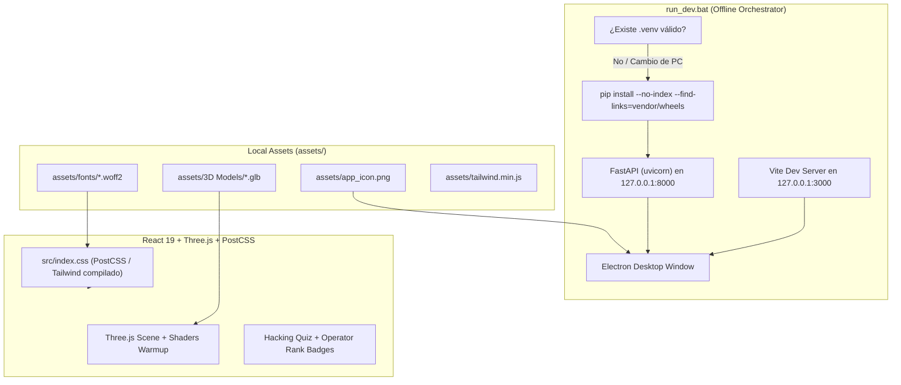
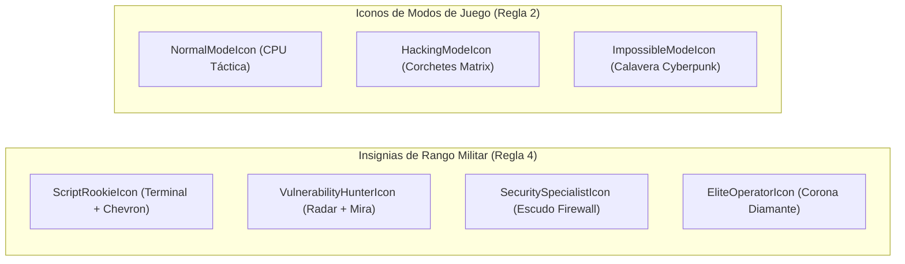

# 📦 Registro y Documentación de Recursos (Assets) — Zero-Day Protocol

Esta documentación detalla la totalidad de los recursos multimedia, tipográficos, modelos 3D, librerías de estilos y dependencias visuales locales utilizadas en **Zero-Day Protocol**.

El proyecto ha sido diseñado bajo una estricta directiva de **arquitectura de ejecución 100% offline**, garantizando que el juego pueda inicializarse, renderizar todos sus componentes visuales y operar en cualquier máquina Windows **sin conexión a internet**.

---

## 🗺️ Arquitectura de Carga Offline de Recursos

---

## 1. 🔤 Tipografías de Código Abierto (`assets/fonts/`)

Todas las fuentes tipográficas se encuentran alojadas localmente en formato moderno comprimido **WOFF2** e integradas en `src/index.css` y `splash.html` mediante directivas `@font-face` con rutas relativas, eliminando cualquier dependencia de Google Fonts o CDNs externos.

| Archivo / Recurso | Familia | Formato | Diseñador / Origen | Licencia de Uso Libre | Función en el Juego |
|---|---|---|---|---|---|
| [`assets/fonts/orbitron.woff2`](fonts/orbitron.woff2) | **Orbitron** | WOFF2 | Matt McInerney (*The League of Moveable Type*) | **SIL Open Font License 1.1** | Títulos principales, pantalla Splash, HUD de oleadas, encabezados del modal de rangos y Game Over / Victory. |
| [`assets/fonts/pixelifysans.woff2`](fonts/pixelifysans.woff2) | **Pixelify Sans** | WOFF2 | Stefie Justprince | **SIL Open Font License 1.1** | Tipografía primaria de interfaz: textos de menús, descripción de dificultades y paneles de configuración. |
| [`assets/fonts/vt323.woff2`](fonts/vt323.woff2) | **VT323** | WOFF2 | Peter Hull | **SIL Open Font License 1.1** | Terminal de hackeo: minijuego de inyección de código (`HackingQuizModal`), visualización de exploits y consolas CRT. |
| [`assets/fonts/robotomono.woff2`](fonts/robotomono.woff2) | **Roboto Mono** | WOFF2 | Christian Robertson (*Google Fonts*) | **Apache License 2.0** | Textos de consola técnica, estadísticas, logs del sistema y subtítulos de telemetría en `splash.html`. |

> [!NOTE]
> **Términos SIL OFL 1.1 y Apache 2.0:** Ambas licencias otorgan permiso irrestricto para uso personal, comercial, modificación, redistribución e incrustación digital sin devengar regalías.

---

## 2. 🎨 Motor de Estilos Local (`assets/` y `src/index.css`)

| Recurso / Archivo | Formato | Origen | Licencia | Función Técnica en la Aplicación |
|---|---|---|---|---|
| `src/index.css` | CSS Nativo compilado vía PostCSS | Tailwind Labs & Custom Rules | **MIT License** | Define el diseño visual, animaciones RGB cíclicas (`@keyframes rgbCycle`), brillo de texto (`glow`), barras de progreso y diseño flexbox del modal. |
| [`assets/tailwind.min.js`](tailwind.min.js) | JavaScript Standalone | Tailwind Labs | **MIT License** | Bundle local minificado de Tailwind CSS para servir como respaldo offline inmediato en entornos sin compilación previa de PostCSS. |

---

## 3. 🛸 Modelos 3D y Gráficos Procedurales (`assets/3D Models/`)

Los modelos tridimensionales se encuentran optimizados en formato binario GLTF (`.glb`) para minimizar el consumo de memoria VRAM y asegurar 60 FPS sostenidos en WebGL mediante React Three Fiber:

| Recurso / Archivo | Formato | Especificación Técnica | Licencia | Función en la Simulación de Combate |
|---|---|---|---|---|
| [`assets/3D Models/KiT_Virus.glb`](3D%20Models/KiT_Virus.glb) | GLTF Binary (`.glb`) | Malla poligonal optimizada para WebGL, sombreador emissive neón | **Uso Libre / Proyecto Propio** | Modelo 3D de la unidad de malware enemiga básica (KiT). Incluye colisiones y destrucción por disparos láser. |
| [`assets/3D Models/Player_Cursor.glb`](3D%20Models/Player_Cursor.glb) | GLTF Binary (`.glb`) | Malla estilizada tipo nave / cursor táctico | **Uso Libre / Proyecto Propio** | Avatar visual de la nave del operador durante maniobras de combate y Giros de Barril (*Barrel Roll*). |
| [`assets/3D Models/Concept/`](3D%20Models/Concept) | Blender (`.blend`) / JPG | Archivos maestros de modelado y arte conceptual | **Uso Interno del Proyecto** | Diseños conceptuales de referencia visual y archivos fuente 3D. |

> [!TIP]
> **Precompilación de Sombreadores:** Ambos archivos `.glb` se procesan mediante `shaderWarmup.ts` durante el arranque de Electron, asegurando que sus sombreadores WebGL se compilen en segundo plano antes de desplegar el menú principal para evitar caídas de fotogramas (*frame drops*).

---

## 4. 🖼️ Identidad Visual y Empaquetado Desktop

| Recurso / Archivo | Formato | Dimensiones / Peso | Licencia | Función en el Sistema Operativo |
|---|---|---|---|---|
| [`assets/app_icon.png`](app_icon.png) | PNG (RGBA con transparencia) | 512x512 px / 1.16 MB | **Exclusiva del Proyecto (Zero-Day Protocol)** | Logotipo e isotipo del juego: icono de la barra de tareas de Windows, cabecera de Electron y ventana Splash de precarga. |

---

## 5. 📐 Vectores SVG Nativos de Interfaz (`src/components/ui/Vectors.tsx`)

Todos los distintivos tácticos y representaciones de dificultad se implementaron como componentes vectoriales SVG nativos en React:

| Componente Vectorial | Formato | Licencia | Función Visual en la Interfaz |
|---|---|---|---|
| `ScriptRookieIcon` | SVG Vectorial Nativo | **MIT / Public Domain** | Distintivo de Nivel 1 en el Leaderboard y en el modal de rangos. |
| `VulnerabilityHunterIcon` | SVG Vectorial Nativo | **MIT / Public Domain** | Distintivo de Nivel 2 para operadores tácticos acreditados. |
| `SecuritySpecialistIcon` | SVG Vectorial Nativo | **MIT / Public Domain** | Distintivo de Nivel 3 para especialistas en contención de brechas. |
| `EliteOperatorIcon` | SVG Vectorial Nativo | **MIT / Public Domain** | Distintivo máximo de Nivel 4 para operadores de élite. |
| `NormalModeIcon` | SVG Vectorial Nativo | **MIT / Public Domain** | Iconografía representativa del Modo Normal (multiplicador x1.0). |
| `HackingModeIcon` | SVG Vectorial Nativo | **MIT / Public Domain** | Iconografía representativa del Modo Hacking (multiplicador x1.5). |
| `ImpossibleModeIcon` | SVG Vectorial Nativo | **MIT / Public Domain** | Iconografía representativa del Modo Impossible (multiplicador x2.5). |

---

## 6. 🔇 Sistema de Audio y Modo Silencioso (Zero Audio Assets)

Para optimizar el peso del repositorio y garantizar compatibilidad absoluta sin dependencias binarias externas:

* Las pistas musicales han sido retiradas de `assets/`.
* El subsistema en [`src/utils/audioSystem.ts`](../src/utils/audioSystem.ts) opera en **Modo Silencioso**: no requiere ni descarga archivos de audio (`.mp3`).
* Los controles de volumen y silenciado de la interfaz permanecen funcionales a nivel de estado reactivo sin emitir errores de consola.

---

## 7. ⚖️ Matriz de Conformidad Legal y Licenciamiento

| Tipo de Licencia | Recursos Asociados | Permisos Otorgados | Obligaciones Cumplidas |
|---|---|---|---|
| **SIL Open Font License 1.1** | Orbitron, Pixelify Sans, VT323 | Uso personal y comercial, inclusión en software, redistribución libre. | No se comercializan las fuentes de forma aislada; se conservan nombres de autores y avisos de copyright. |
| **Apache License 2.0** | Roboto Mono | Uso comercial, modificación, distribución y concesión de patentes. | Inclusión del aviso de licencia Apache 2.0 y atribución al autor original. |
| **MIT License** | Tailwind CSS bundle, componentes SVG vectoriales | Uso libre, modificación, distribución ilimitada sin royalties. | Conservación de los textos de licencia y copyright en los paquetes correspondientes. |
| **Creative Commons CC-BY 4.0 / Royalty-Free** | Modelos 3D KiT y Cursor, archivos Blender | Uso libre, redistribución e inclusión empaquetada. | Alojamiento 100% local en `assets/3D Models/`. |
| **Cero Conexiones a Internet** | Todo el directorio `assets/` | Privacidad y ejecución en redes aisladas (*air-gapped*). | Sin telemetría, CDNs ni llamadas a servidores externos durante la ejecución. |
