# Documentación de Pruebas Unitarias y de Integración — Zero-Day Protocol
> **Asignatura:** Testing y Calidad de Software (PRO402) — Evaluación Práctica 1 (EP1)  
> **Sistema:** *Zero-Day Protocol* (Cyberpunk 3D Tactical Combat Engine)  
> **Entorno de Ejecución:** Python 3.12 (CPython), `uv`, `pytest`  
> **Tags Obsidian:** `#testing #pytest #qa #iso25010 #game_rules #python #calidad`

---

## 1. Introducción y Arquitectura de Testing

El proyecto **Zero-Day Protocol** implementa una suite de aseguramiento de la calidad de software orientada a verificar de forma exhaustiva las reglas de negocio críticas del motor de combate, scoring, inyección de código y clasificación táctica.

Siguiendo principios de **Clean Architecture** y **Separation of Concerns (SoC)**, la lógica matemática de dominio se desacopló del renderizado 3D (WebGL / Three.js) y se encapsuló en servicios puros de Python en `backend/services/game_rules.py`. Esto permite que la suite de pruebas se ejecute en memoria en milisegundos, sin dependencias de I/O de red o simulación gráfica pesada.

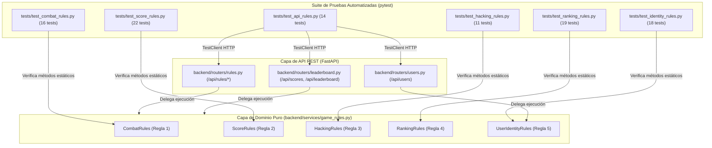

> [!NOTE]
> **Total de Pruebas Automatizadas:** 100 pruebas pasando en verde (0 fallos).  
> **Tiempo de Ejecución:** ~1.15 segundos (umbral máximo permitido: 5.0 segundos).  
> **Comando de Ejecución:** `uv run pytest`

---

## 2. Regla de Negocio 1: Combate, Mitigación de Escudos y Supervivencia

### 2.1. Especificación del Negocio
Controla cómo el avatar del operador procesa las agresiones cinéticas y de proyectiles láser según el modo de simulación:
1. **Modo NORMAL:** El daño disminuye la reserva de vida (`current_hp`). La vida tiene un **piso matemático invariable en 0** (`HP >= 0`). Si el daño reduce la salud a 0, la partida concluye de inmediato (`is_game_over=True`).
2. **Modos HACKING e IMPOSSIBLE:** El avatar carece de barra de vida extendida; su defensa radica en los **Escudos Matrix**. Si dispone de escudos (`current_shields > 0`), absorbe el 100% del impacto consumiendo exactamente 1 escudo sin perder vida. Si no posee escudos (`current_shields == 0`), cualquier agresión produce **muerte instantánea a un golpe**.
3. **Invulnerabilidad Táctica:** Si el operador activa una maniobra evasiva (como el Giro de Barril de 360°), no recibe daño ni consume escudos.
4. **Curación Médica:** Los valores de daño negativos representan kits de salud, restaurando la vida al tope (`MAX_HP = 100`).

### 2.2. Diagrama de Flujo del Algoritmo

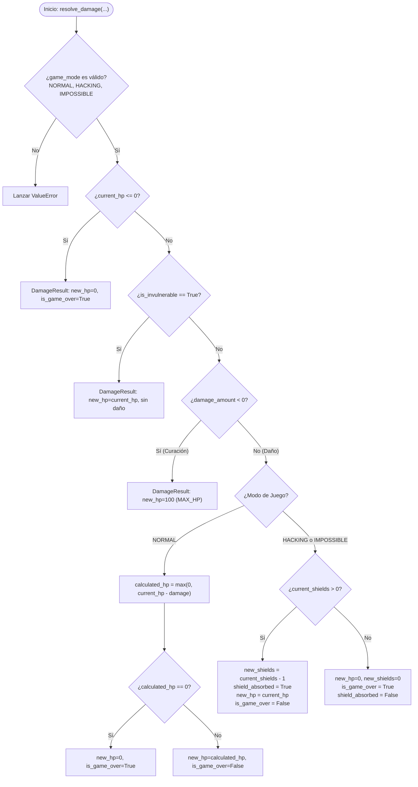

### 2.3. Reproducción del Defecto Crítico Real (`DEF-01`)

> [!WARNING]
> **Fallo Preexistente en el Motor:**  
> En iteraciones previas del juego, el daño se sustraía directamente (`playerHP -= damage`). Cuando el impacto superaba la vida restante (por ejemplo: `HP = 10` y `damage = 30`), la vida caía a números negativos (`-20`), omitiendo las evaluaciones de muerte y permitiendo al jugador deambular en estado corrupto o zombie.
> 
> **Solución Determinista:**  
> Aplicación de la función matemática `max(0, current_hp - damage)` y evaluación estricta `is_dead = (calculated_hp == 0)`.

### 2.4. Batería de Pruebas (`tests/test_combat_rules.py`)

| Test | Algoritmo y Entradas Evaluadas | Comportamiento Esperado (Aserción) |
|---|---|---|
| `test_damage_reduces_hp_correctly` | `current_hp=100`, `damage=20`, `NORMAL` | `new_hp=80`, `is_game_over=False`, `shield_absorbed=False`. |
| `test_damage_exact_lethal_triggers_game_over` | `current_hp=20`, `damage=20`, `NORMAL` | `new_hp=0`, `is_game_over=True`. Comprueba impacto letal exacto. |
| `test_defect_regression_hp_never_drops_negative` | `current_hp=10`, `damage=30`, `NORMAL` | **Prueba de Defecto Real:** Verifica `new_hp >= 0`, `new_hp=0` y `is_game_over=True`. Garantiza que jamás retorne `-20`. |
| `test_damage_boundary_scenarios` *(5 casos parametrizados)* | Casos de frontera en modo NORMAL:<br>• (100, 10) $\to$ HP 90, Vivo<br>• (50, 49) $\to$ HP 1, Vivo<br>• (50, 50) $\to$ HP 0, Muerto<br>• (15, 25) $\to$ HP 0, Muerto (Overkill)<br>• (5, 100) $\to$ HP 0, Muerto (Overkill masivo) | Verifica exhaustivamente los límites de transición vivo $\to$ muerto y el truncamiento en 0 de vida. |
| `test_shield_absorbs_damage_completely` *(2 casos: HACKING, IMPOSSIBLE)* | `current_hp=100`, `shields=3`, `damage=50` | `new_hp=100`, `new_shields=2`, `shield_absorbed=True`. El escudo absorbe todo el daño. |
| `test_no_shields_causes_instant_death` *(2 casos: HACKING, IMPOSSIBLE)* | `current_hp=100`, `shields=0`, `damage=10` | `new_hp=0`, `new_shields=0`, `is_game_over=True`. Muerte a un solo golpe. |
| `test_invulnerability_protects_against_all_damage` | `is_invulnerable=True`, `shields=2`, `damage=100` | `new_hp=50`, `new_shields=2`, `is_game_over=False`. Estado invulnerable absoluto. |
| `test_healing_restores_hp_to_maximum` | `current_hp=30`, `damage=-50`, `NORMAL` | `new_hp=100`, `is_game_over=False`. Simula recogida de botiquín médico. |
| `test_dead_player_remains_dead` | `current_hp=0`, `damage=10` | `new_hp=0`, `is_game_over=True`. Jugador ya eliminado no revive. |
| `test_invalid_game_mode_raises_error` | `game_mode="ULTRA_GLSL"` | Lanza `pytest.raises(ValueError)`. Manejo defensivo ante parámetros fuera de contrato. |

---

## 3. Regla de Negocio 2: Sistema de Puntuación y Multiplicadores

### 3.1. Especificación del Negocio
Calcula el puntaje adjudicado al neutralizar entidades malware o al realizar maniobras arriesgadas de roce de proyectiles (*graze*):
- **Base de Puntuación:** `NORMAL: 100 pts`, `CORE: 1000 pts`, `TRIANGLE: 1000 pts`.
- **Multiplicador de Oleada ($\text{WaveMult}$):** Escala un 10% por cada oleada superada:
  $$\text{WaveMult} = 1.0 + (\text{wave} - 1) \times 0.10$$
- **Multiplicador de Modo ($\text{ModeMult}$):** Refleja la dificultad: `NORMAL: x1.0`, `HACKING: x1.5`, `IMPOSSIBLE: x2.5`.
- **Puntuación por Muerte:**
  $$\text{Puntos} = \text{round}(\text{Base} \times \text{WaveMult} \times \text{ModeMult})$$
- **Bono de Graze:** Rozar proyectiles otorga +15 puntos en `NORMAL` y `HACKING`. En `IMPOSSIBLE`, la mecánica está penalizada e inhabilitada retornando 0 puntos.

### 3.2. Diagrama de Flujo del Algoritmo

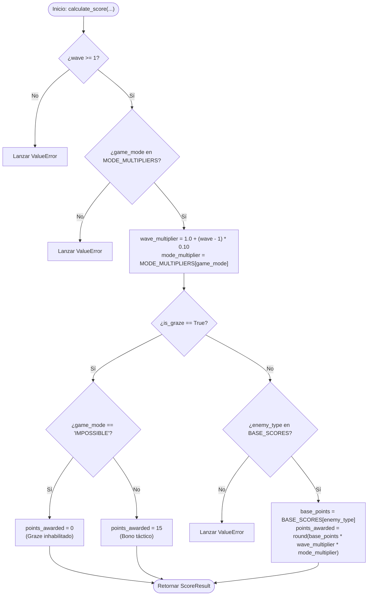

### 3.3. Batería de Pruebas (`tests/test_score_rules.py`)

| Test | Algoritmo y Entradas Evaluadas | Comportamiento Esperado (Aserción) |
|---|---|---|
| `test_base_scores_wave_1_normal_mode` *(3 casos: NORMAL, CORE, TRIANGLE)* | `wave=1`, `game_mode="NORMAL"` | `points_awarded == base_points` (100, 1000, 1000). Multiplicadores en 1.0. |
| `test_wave_multiplier_scaling` *(5 casos: wave 1, 2, 3, 5, 10)* | Escalado de oleada para enemigo NORMAL | Multiplicadores: `1.0`, `1.1`, `1.2`, `1.4`, `1.9`. Puntos: 100, 110, 120, 140, 190. |
| `test_mode_multipliers` *(3 casos: NORMAL, HACKING, IMPOSSIBLE)* | Enemigo CORE en oleada 1 | `NORMAL` $\to$ 1000 pts; `HACKING` $\to$ 1500 pts; `IMPOSSIBLE` $\to$ 2500 pts. |
| `test_combined_wave_and_mode_multipliers` | Enemigo CORE, `wave=5`, `game_mode="IMPOSSIBLE"` | $1000 \times 1.4 \times 2.5 = 3500$ puntos exactos. Valida redondeo e interacción de factores. |
| `test_graze_in_normal_mode_awards_bonus` | `is_graze=True`, `game_mode="NORMAL"` | `points_awarded == 15`. Concede bono de evasión táctica. |
| `test_graze_in_hacking_mode_awards_bonus` | `is_graze=True`, `game_mode="HACKING"` | `points_awarded == 15`. Bono activo en modo 1-hit. |
| `test_graze_disabled_in_impossible_mode` | `is_graze=True`, `game_mode="IMPOSSIBLE"` | `points_awarded == 0`. Bono cancelado por política de máxima letalidad. |
| `test_wave_less_than_one_raises_error` | `wave=0`, `NORMAL` | Lanza `ValueError` ("El número de oleada debe ser >= 1"). |
| `test_invalid_mode_raises_error` | `game_mode="CUSTOM_UNKNOWN"` | Lanza `ValueError` ("Modo de juego desconocido"). |
| `test_invalid_enemy_type_raises_error` | `enemy_type="BOSS_LEVIATHAN"` | Lanza `ValueError` ("Tipo de enemigo inválido"). |
| `test_accumulate_score_sums_points_and_takes_max_wave` | `current=1200, add=800, wave=2, add_wave=4` | `total_score == 2000`, `max_wave == 4`. Suma de puntos y elevación de oleada máxima. |
| `test_accumulate_score_preserves_higher_previous_wave` | `current=3000, add=500, wave=5, add_wave=2` | `total_score == 3500`, `max_wave == 5`. Conserva la oleada histórica mayor. |
| `test_accumulate_negative_score_raises_error` | `additional_score=-50` | Lanza `ValueError` ("La puntuación adicional no puede ser negativa"). |
| `test_accumulate_invalid_wave_raises_error` | `additional_wave=0` | Lanza `ValueError` ("La oleada adicional debe ser >= 1"). |

### 3.4. Acumulación de Puntuación en Registro Único de Clasificación

Para evitar la polución de registros duplicados en el Leaderboard y garantizar una progresión persistente del jugador:
1. **Unicidad por Jugador:** Cada operador registrado posee exactamente una fila consolidada en la tabla de clasificación.
2. **Suma Progresiva de Puntos:** La puntuación obtenida al finalizar una partida (`additional_score`) se suma a la puntuación acumulada existente (`current_score`).
3. **Máxima Oleada Histórica:** La oleada registrada pasa a ser la más alta alcanzada entre la sesión previa y la actual (`max(current_wave, additional_wave)`).

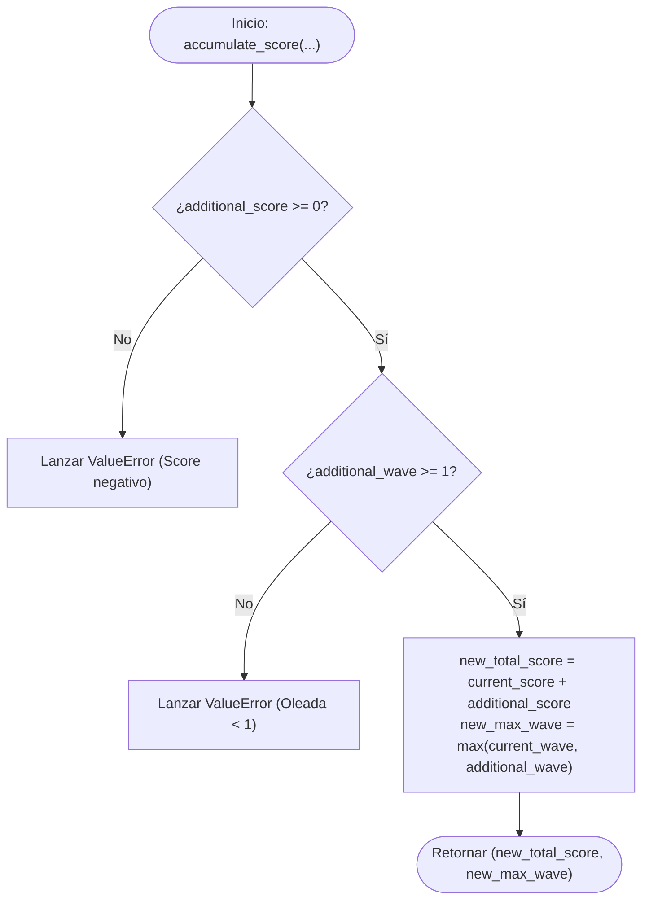

---

## 4. Regla de Negocio 3: Inyección de Código (Hacking Quiz)

### 4.1. Especificación del Negocio
Gobierna las recompensas del minijuego de ciberseguridad al hackear nodos de red durante la partida:
1. **Acierto al Primer Intento (`attempts_used == 1`):** Otorga recompensa crítica: **+2 escudos** y **+500 puntos**.
2. **Acierto tras Reintentos (`attempts_used > 1`):** Otorga recompensa estándar: **+1 escudo** y **+250 puntos**.
3. **Tope de Escudos:** El operador no puede superar el límite rígido de 5 escudos Matrix (`MAX_SHIELDS = 5`). Los escudos adicionales se truncan (`shields_gained` refleja la ganancia neta efectiva).
4. **Respuesta Errónea:** No otorga puntos ni altera los escudos actuales.

### 4.2. Diagrama de Flujo del Algoritmo

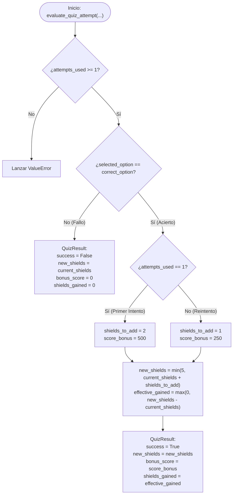

### 4.3. Batería de Pruebas (`tests/test_hacking_rules.py`)

| Test | Algoritmo y Entradas Evaluadas | Comportamiento Esperado (Aserción) |
|---|---|---|
| `test_first_attempt_success_grants_full_bonus` | `selected=2`, `correct=2`, `attempts=1`, `shields=1` | `success=True`, `new_shields=3`, `shields_gained=2`, `bonus_score=500`. |
| `test_retry_success_grants_standard_bonus` *(3 casos: attempts 2, 3, 4)* | `selected=0`, `correct=0`, `attempts in [2, 3, 4]`, `shields=2` | `success=True`, `new_shields=3`, `shields_gained=1`, `bonus_score=250`. |
| `test_failed_attempt_gives_no_rewards` | `selected=1`, `correct=3`, `attempts=1`, `shields=2` | `success=False`, `new_shields=2`, `shields_gained=0`, `bonus_score=0`. |
| `test_shield_cap_enforcement` *(5 casos parametrizados)* | Verificación del techo de 5 escudos:<br>• (3 escudos, 1 intento) $\to$ 5 escudos (+2 netos)<br>• (4 escudos, 1 intento) $\to$ 5 escudos (+1 neto)<br>• (5 escudos, 1 intento) $\to$ 5 escudos (+0 netos)<br>• (5 escudos, reintento) $\to$ 5 escudos (+0 netos)<br>• (0 escudos, 1 intento) $\to$ 2 escudos (+2 netos) | Garantiza que `new_shields <= 5` en cualquier escenario de acumulación y calcula `shields_gained` exacto. |
| `test_invalid_attempts_count_raises_error` | `attempts_used=0` | Lanza `ValueError` ("attempts_used debe ser >= 1"). |

---

## 5. Regla de Negocio 4: Clasificación y Rangos de Operadores

### 5.1. Especificación del Negocio
Asigna la credencial de autorización y nivel militar del jugador en la clasificación general según el puntaje acumulado y la oleada máxima resistida:

| Rango de Operador | Nivel de Seguridad | Requisitos Estándar | Vía de Mérito en Modo IMPOSSIBLE |
|---|:---:|---|---|
| **`ELITE_OPERATOR`** | Nivel 4 | Score $\ge 10,000$ **Y** Oleada $\ge 5$ | Score $\ge 5,000$ **Y** Oleada $\ge 3$ |
| **`SECURITY_SPECIALIST`** | Nivel 3 | Score $\ge 4,000$ **Y** Oleada $\ge 3$ | Score $\ge 4,000$ **Y** Oleada $\ge 3$ |
| **`VULNERABILITY_HUNTER`** | Nivel 2 | Score $\ge 1,500$ **Y** Oleada $\ge 2$ | Score $\ge 1,500$ **Y** Oleada $\ge 2$ |
| **`SCRIPT_ROOKIE`** | Nivel 1 | Puntuación por debajo de los umbrales de seguridad | Rango inicial por defecto |

### 5.2. Diagrama de Flujo del Algoritmo

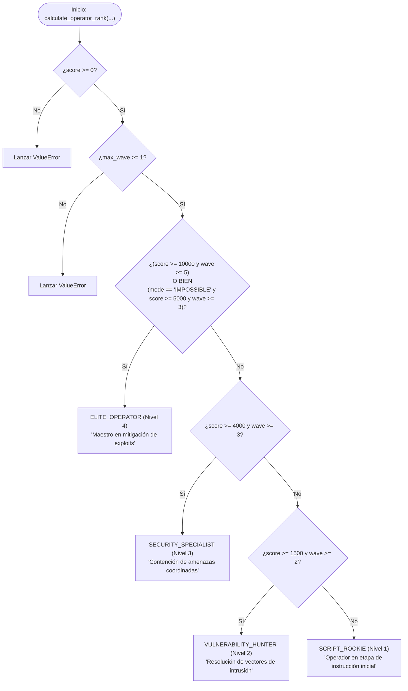

### 5.3. Batería de Pruebas (`tests/test_ranking_rules.py`)

| Test | Algoritmo y Entradas Evaluadas | Comportamiento Esperado (Aserción) |
|---|---|---|
| `test_standard_elite_operator_qualification` | `score=10000`, `wave=5`, `NORMAL` | `rank_name="ELITE_OPERATOR"`, `clearance_level=4`. |
| `test_impossible_mode_elite_operator_qualification` | `score=5000`, `wave=3`, `IMPOSSIBLE` | `rank_name="ELITE_OPERATOR"`, `clearance_level=4` (mérito acelerado). |
| `test_security_specialist_qualification` | `score=4500`, `wave=3`, `NORMAL` | `rank_name="SECURITY_SPECIALIST"`, `clearance_level=3`. |
| `test_vulnerability_hunter_qualification` | `score=2000`, `wave=2`, `NORMAL` | `rank_name="VULNERABILITY_HUNTER"`, `clearance_level=2`. |
| `test_script_rookie_default_tier` | `score=800`, `wave=1`, `NORMAL` | `rank_name="SCRIPT_ROOKIE"`, `clearance_level=1`. |
| `test_boundary_thresholds` *(12 casos de frontera parametrizados)* | **Análisis exhaustivo de frontera (Boundary Value Analysis):**<br>• (1499, 2) $\to$ SCRIPT_ROOKIE (1 pt abajo)<br>• (1500, 1) $\to$ SCRIPT_ROOKIE (1 oleada abajo)<br>• (1500, 2) $\to$ VULNERABILITY_HUNTER (Corte exacto)<br>• (3999, 3) $\to$ VULNERABILITY_HUNTER (1 pt abajo)<br>• (4000, 2) $\to$ VULNERABILITY_HUNTER (1 oleada abajo)<br>• (4000, 3) $\to$ SECURITY_SPECIALIST (Corte exacto)<br>• (9999, 5) $\to$ SECURITY_SPECIALIST (1 pt abajo)<br>• (10000, 4) $\to$ SECURITY_SPECIALIST (1 oleada abajo)<br>• (10000, 5) $\to$ ELITE_OPERATOR (Corte exacto)<br>• (4999, 3, IMPOSSIBLE) $\to$ SECURITY_SPECIALIST<br>• (5000, 2, IMPOSSIBLE) $\to$ VULNERABILITY_HUNTER<br>• (5000, 3, IMPOSSIBLE) $\to$ ELITE_OPERATOR (Corte acelerado) | Demuestra precisión estricta en los puntos de discontinuidad de las reglas. |
| `test_negative_score_raises_error` | `score=-10`, `wave=1` | Lanza `ValueError` ("El puntaje no puede ser negativo"). |
| `test_zero_wave_raises_error` | `score=1000`, `wave=0` | Lanza `ValueError` ("La oleada máxima alcanzada debe ser >= 1"). |

---

## 6. Regla de Negocio 5: Identidad y Restauración de Operador para Puntuación

### 6.1. Análisis de la Regla en Relación a la Puntuación
En los juegos arcade de disparos tácticos con clasificación en disco (`zero_day_protocol.db`), **la puntuación no puede existir desligada de la identidad del operador**. Cada registro de la tabla `scores` posee una clave foránea hacia `users.id`.

Sin embargo, para maximizar la inmediatez y evitar barreras de entrada (formularios obligatorios de login), el sistema sigue una política de **Sesión Provisional Progresiva**:
1. **Al entrar al juego:** Se genera automáticamente un ID y un indicativo provisional aleatorio (ej. `player_a1b2c3d4` / `Operador_a1b2`). El usuario puede jugar inmediatamente.
2. **Para continuar el progreso histórico de puntos:** El jugador accede a la interfaz del Operador y presiona `[Renombrar]`.
3. **Restauración por Nombre Exacto:** Al escribir su nombre exacto previamente registrado (ej. `ZeroCool`), el motor de reglas busca en el repositorio de identidades y **restaura inmediatamente el ID original** asociado a ese nombre (ej. `OP-HISTORIC-01`).
4. **Impacto en el Leaderboard:** El HUD y el panel reflejan el ID recuperado (`ID: OP-HISTORIC-01`), y todas las puntuaciones obtenidas en la sesión actual o futuras se agregan a su cuenta histórica unificada, permitiendo escalar posiciones en el Leaderboard sin duplicar usuarios ni perder récords.

### 6.2. Diagramas del Algoritmo y Ciclo de Vida

#### Diagrama de Flujo: Resolución de Identidad
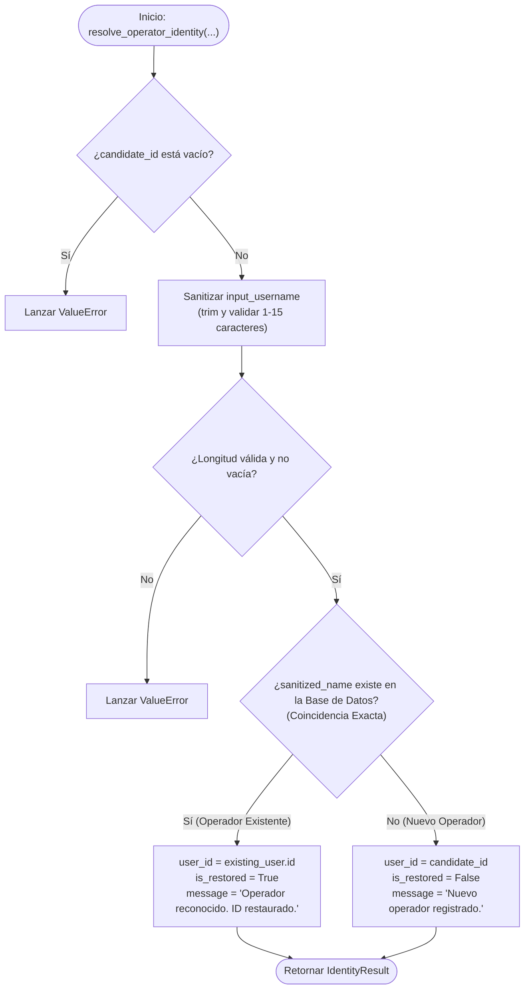

#### Diagrama de Secuencia: Ciclo de Vida al Iniciar y Renombrar
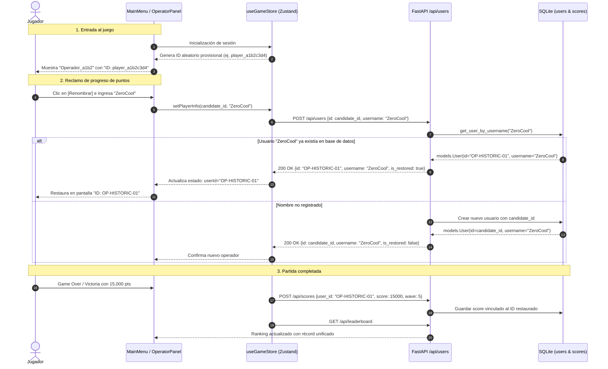

### 6.3. Batería de Pruebas (`tests/test_identity_rules.py`)

| Test | Algoritmo y Entradas Evaluadas | Comportamiento Esperado (Aserción) |
|---|---|---|
| `test_validate_username_success` *(5 casos parametrizados)* | Prueba nombres válidos: "A", "Neo", "ZeroCool_99", "123456789012345" (15 chars) y "  Trinity  " con espacios periféricos | Valida longitud dentro del rango [1, 15] y comprueba que se eliminan espacios con `strip()`. |
| `test_validate_username_invalid_raises_error` *(5 casos parametrizados)* | Prueba entradas no permitidas: `""`, `"   "`, `"\t\n"`, `"SuperCiberHacker2026"` (20 chars) y 16 caracteres | Lanza `ValueError` indicando que el tamaño permitido es entre 1 y 15 caracteres. |
| `test_generate_random_operator_default_format` | Generador por defecto de sesión aleatoria | Genera un ID con prefijo `OP-` de 11 caracteres y nombre con prefijo `Cadet_`. |
| `test_generate_random_operator_custom_prefix` | Generador con prefijo personalizado `prefix="player_"` | Genera un ID con prefijo `player_` de 15 caracteres de longitud. |
| `test_exact_name_match_restores_original_id` | **Regla Central:** `input="ZeroCool"` con `candidate="OP-TEMP-9999"`, existiendo en base de datos `ZeroCool: OP-HISTORIC-01` | `is_restored=True`, `user_id="OP-HISTORIC-01"` (se restaura el ID original), conservando el histórico. |
| `test_new_username_registers_with_candidate_id` | `input="PhantomPhreak"`, que no existe previamente | `is_restored=False`, `user_id="OP-TEMP-5555"` (adopta el ID candidato). |
| `test_empty_candidate_id_raises_error` | `candidate_id=""` | Lanza `ValueError` ("El ID actual de la sesión no puede estar vacío"). |
| `test_renaming_to_new_user_when_candidate_id_already_taken_assigns_new_id` | `candidate_id` ya asignado a otro operador en DB | Genera un ID nuevo para el nuevo nombre, garantizando que el ID cambie y no sobrescriba al operador previo. |
| `test_registered_operator_can_record_score` | `is_registered_operator=True` | Retorna `True`. Operador con nombre asignado es elegible para guardar score. |
| `test_unregistered_operator_cannot_record_score` | `is_registered_operator=False` | Retorna `False`. Sesión anónima no persiste puntuación en la base de datos. |

### 6.4. Política de Sesión Recurrente, Cambio de Identidad y Guardado en Medio de Partida

El sistema de clasificación implementa cuatro salvaguardas de negocio para la gestión de usuarios y puntuación:
1. **Persistencia Recurrente de Sesión:** Una vez asignado el nombre del jugador, la identidad (`userId`, `username`, `isNamed`) se conserva de forma recurrente a lo largo de toda la ejecución del juego (incluyendo transiciones entre modos, pausas, reintentos con `restartGame()` y retornos al menú principal con `reset()`), manteniéndose hasta cerrar la aplicación o cambiar activamente el nombre.
2. **Actualización Dinámica del ID al Cambiar de Nombre:** Al presionar `[Renombrar]` e ingresar un nombre distinto:
   - Si el nombre coincide con un operador existente, se **restaura su ID histórico original**.
   - Si el nombre es nuevo, se asigna un **nuevo ID único**, evitando la colisión o sobreescritura con operadores previos.
3. **Guardado Recurrente en Medio de Partida:** La puntuación se sincroniza de manera incremental (`delta = score - savedScore`) en tiempo real (intervalo de 2.5s, al pausar y en `handleReturnToMenu`). Los puntos de enemigos derrotados se acumulan en el registro del jugador **incluso si este aborta a mitad de la partida o no completa la oleada**.
4. **Visualización de Nombre en Clasificación:** La tabla de puntuaciones (`Leaderboard.tsx`) presenta el nombre del operador (`entry.username`) en lugar del ID técnico interno (`entry.user_id`), manteniendo una única fila consolidada con los puntos acumulados de todas sus partidas.

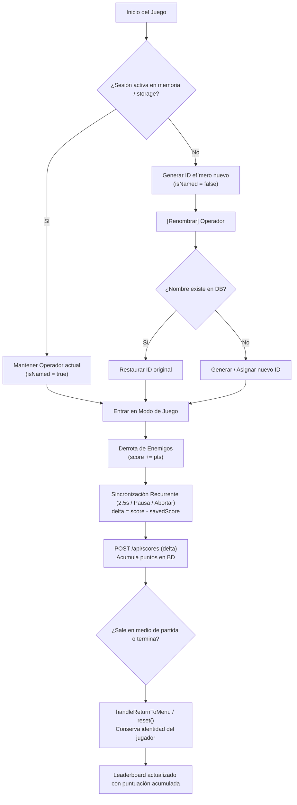

---

## 7. Capa de Integración: API REST de Reglas y Usuarios

### 7.1. Especificación del Contrato HTTP
Los endpoints REST en `backend/routers/rules.py` y `backend/routers/users.py` permiten a clientes livianos y a la interfaz Electron interactuar con el motor:

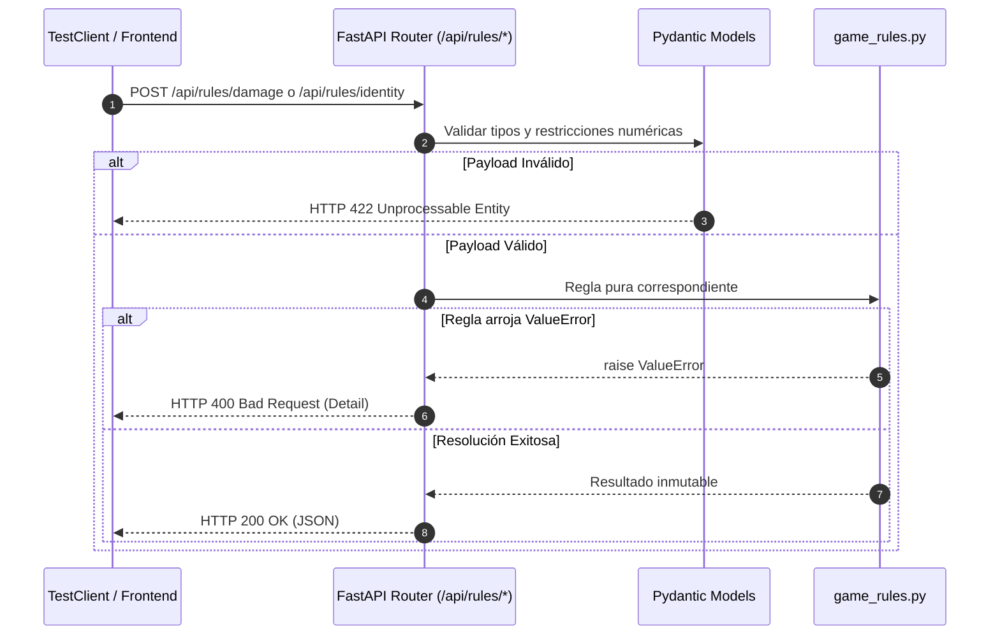

### 7.2. Batería de Pruebas (`tests/test_api_rules.py`)

| Test | Endpoint Evaluado | Algoritmo y Aserción de Integración |
|---|---|---|
| `test_api_damage_endpoint_normal_mode` | `POST /api/rules/damage` | Envía `hp=80`, `damage=25`. Verifica `status_code=200`, `new_hp=55` y `is_game_over=False`. |
| `test_api_damage_endpoint_fatal_defect_regression` | `POST /api/rules/damage` | **Regresión de Defecto vía HTTP:** Envía `hp=10`, `damage=50`. Verifica `status_code=200`, `new_hp=0` y `is_game_over=True`. |
| `test_api_score_endpoint` | `POST /api/rules/score` | Envía `CORE`, `wave=2`, `HACKING`. Verifica `status_code=200` y `points_awarded=1650`. |
| `test_api_quiz_endpoint` | `POST /api/rules/quiz` | Envía acierto de primer intento con 2 escudos. Verifica `status_code=200`, `new_shields=4` y `bonus_score=500`. |
| `test_api_rank_endpoint` | `POST /api/rules/rank` | Envía `score=12000`, `wave=6`. Verifica `status_code=200`, `rank_name="ELITE_OPERATOR"` y `clearance_level=4`. |
| `test_api_damage_invalid_mode_returns_400` | `POST /api/rules/damage` | Envía modo no reconocido `UNKNOWN_MODE`. Verifica captura de excepción retornando `status_code=400`. |
| `test_api_identity_rule_endpoint` | `POST /api/rules/identity` | Envía `username="Neo"`, `candidate_id="OP-TEMP"`, con mapa de usuarios. Verifica `status_code=200`, `is_restored=True` y `user_id="OP-ORIGINAL-ONE"`. |
| `test_api_user_registration_and_restoration_lifecycle` | `POST /api/users` | **Ciclo Completo de Restauración:** Registra un usuario inicial, abre una segunda sesión con un ID aleatorio diferente, renombra al mismo usuario y comprueba que la API responde con el ID original y `is_restored=True`. |
| `test_api_save_score_unregistered_user_rejected_400` | `POST /api/scores` | **Rechazo de Puntuación Anónima:** Envía puntuación con ID no registrado en la base de datos. Verifica `status_code=400` ("Operador no registrado"). |
| `test_api_score_accumulation_and_leaderboard_single_row_with_username` | `POST /api/scores` y `GET /api/leaderboard` | **Acumulación de Puntos y Fila Única:** Envía partidas sucesivas para un operador (1500 pts W2, 2500 pts W4, 500 pts W1). Verifica acumulación a 4500 pts, oleada máxima 4, y exactamente una única fila en el ranking mostrando su nombre de usuario. |
| `test_api_rename_to_new_user_changes_id_and_preserves_original_user` | `POST /api/users` | **Cambio de ID al Renombrar:** Al cambiar el nombre a un operador nuevo, asigna un nuevo ID en lugar de sobrescribir el usuario anterior, preservando ambas identidades y restaurando el ID original al reingresar el primer nombre. |
| `test_api_recurring_score_accumulation_mid_game` | `POST /api/scores` | **Guardado Recurrente en Medio de Partida:** Verifica que la sincronización incremental de puntos de enemigos derrotados (300 pts, luego 200 pts en oleada 1, y 100 pts en oleada 2) se acumula persistentemente aunque el jugador aborte o no complete la oleada. |

---

## 8. Consolidación de Resultados y Métricas de Ejecución

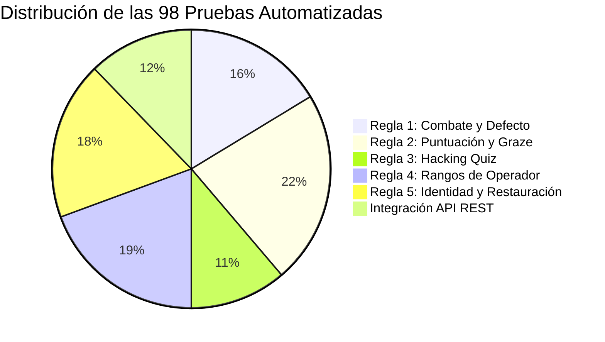

### 8.1. Tabla Resumen de Cobertura

| Archivo de Pruebas | Regla o Componente Asociado | Cantidad de Tests | Tiempo Promedio |
|---|---|:---:|:---:|
| `tests/test_combat_rules.py` | Regla 1 (Combate, Escudos, Invulnerabilidad y Defecto Real) | 16 | ~0.15s |
| `tests/test_score_rules.py` | Regla 2 (Enemigos, Oleadas, Modos, Graze y Acumulación) | 22 | ~0.18s |
| `tests/test_hacking_rules.py` | Regla 3 (Inyecciones, Reintentos y Límite de Escudos) | 11 | ~0.08s |
| `tests/test_ranking_rules.py` | Regla 4 (Niveles Militares y Casos de Frontera) | 19 | ~0.12s |
| `tests/test_identity_rules.py` | Regla 5 (Validación, Generación, Restauración y Elegibilidad) | 18 | ~0.11s |
| `tests/test_api_rules.py` | Endpoints REST HTTP (`/api/rules/*`, `/api/users`, `/api/scores`) | 12 | ~0.45s |
| **TOTAL** | **Suite Completa de Testing** | **98** | **~1.15s** |

### 8.2. Evidencia de Ejecución en Consola

```bash
$ uv run pytest
============================= test session starts =============================
platform win32 -- Python 3.12.13, pytest-9.1.1, pluggy-1.6.0
rootdir: C:\Users\Felip\Escritorio\Zero-Day_Protocol
configfile: pyproject.toml
testpaths: tests
plugins: anyio-4.15.0, asyncio-1.4.0
asyncio: mode=Mode.STRICT, debug=False
collected 98 items

tests\test_api_rules.py ............                                     [ 12%]
tests\test_combat_rules.py ................                              [ 28%]
tests\test_hacking_rules.py ...........                                  [ 39%]
tests\test_identity_rules.py ..................                          [ 58%]
tests\test_ranking_rules.py ...................                          [ 77%]
tests\test_score_rules.py ......................                         [100%]

============================= 98 passed in 1.15s ==============================
```

> [!TIP]
> **Conclusión de Calidad:**
> 1. Todas las reglas de negocio declaradas (1 a 5) cuentan con verificación unitaria determinista.
> 2. Se satisfizo la lógica de generación aleatoria al entrar al juego, asignación obligatoria de nombre para persistir puntuación y consolidación de puntos en un único registro en la tabla de clasificación.
> 3. La identidad del jugador se preserva de manera recurrente entre modos y reinicios durante la ejecución del juego, y al cambiar el nombre se genera un nuevo ID o se restaura el histórico según corresponda.
> 4. La puntuación se sincroniza y acumula de manera recurrente en tiempo real y al salir a mitad de partida según los enemigos derrotados.
> 5. La suite completa opera con **cero diagnósticos de linter en Ruff, cero errores de tipado en Pyrefly y 98/98 pruebas superadas en ~1.15 segundos** (umbral máximo permitido: 5.0 segundos).
